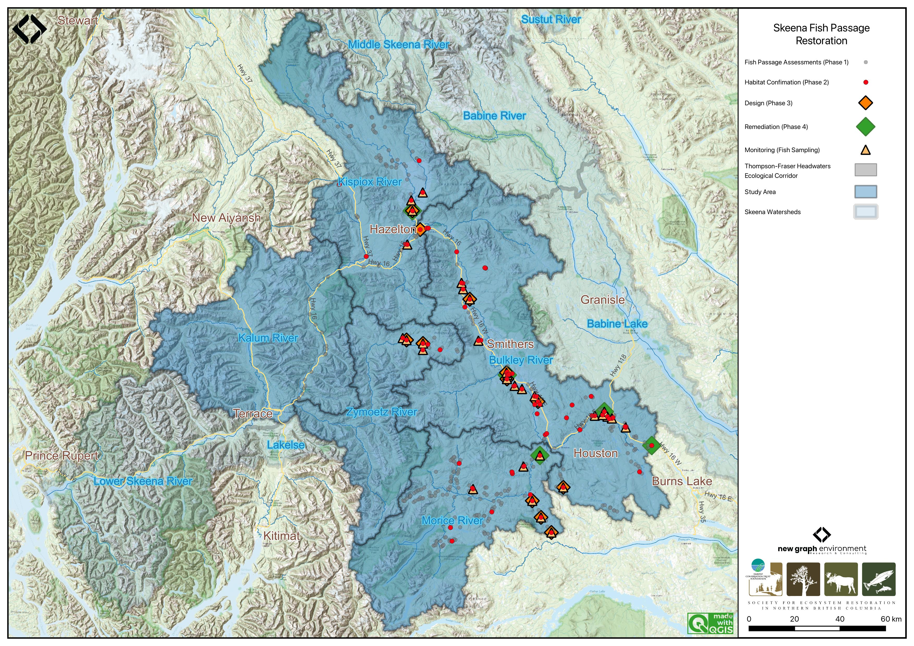

# Background

The study area includes the Bulkley River, Zymoetz River, Kispiox River, Morice River and Kitsumkalum River watershed groups (Figure \@ref(fig:overview-map)) and is within the traditional territories of the Wet'suwet'en, Gitxsan and Tsimshian.

<br>

```{r overview-map, fig.cap = 'Overview map of Study Areas',eval=T}

```


## Wet'suwet'en

Wet'suwet'en hereditary territory covers an area of 22,000km^2^ including the Bulkley River and Morice River watersheds and portions of the Nechako River watershed. The Wet'suwet'en people are a matrilineal society organized into the Gilseyhu (Big Frog), Laksilyu (Small Frog), Tsayu (Beaver clan), Gitdumden (Wolf/Bear) and Laksamshu (Fireweed) clans. Within each of the clans there are are a number of kin-based groups known as Yikhs or House groups. The Yikh is a partnership between the people and the territory. Thirteen Yikhs with Hereditary Chiefs manage a total of 38 distinct territories upon which they have jurisdiction. Within a clan, the head Chief is entrusted with the stewardship of the House territory to ensure the Land is managed in a sustainable manner. Inuk Nu'at'en (Wet'suwet'en law) governing the harvesting of fish within their lands are based on values founded on thousands of years of social, subsistence and environmental dynamics. The Yintahk (Land) is the centre of life as well as culture and it's management is intended to provide security for sustaining salmon, wildlife, and natural foods to ensure the health and well-being of the Wet'suwet'en [@officeofthewetsuweten2013Wetsuwet; @OfficeWetsuweten2021; @flnrord2017NaturalResource].

<br>

## Gitxsan

Gitxsan means "People of the River Mist". The Gitxsan Laxyip (traditional territories) covers an area of 33,000km^2^ within the Skeena River and Nass River watersheds. The Laxyip is governed by 60 Simgiigyet (Hereditary Chiefs), within the traditional hereditary system made up of Wilps (House groups). Anaat are fisheries tenures found throughout the Laxyip. Traditional governance within a matrilineal society operates under the principles of Ayookw (Gitxsan law) [@GitxsanHuwilpGovernment]. Many band members live in Hazelton, Kispiox and Glen Vowell (the Eastern Gitxsan) as well as within Kitwanga, Kitwankool and Kitsegukla (the Western Gitxsan) [@powell_etal2018Gitxsan].

```{r}
# Salmon is considered the source of life and always treated with high regard.  It was brought by the Raven who also taught people how to fish and hunt.

 # The original Gitxsan economy depended heavily on the trade of fish and other natural resources with neighbouring First Nations along "grease trails," which are routes named so because they carried the refined oil of the oolichan, a fish that resembles a smelt that is common in some areas of British Columbia. They are also known for their range of traditional arts 

```

<br>

## Tsimshian
The Kitsumkalum community, part of the Tsimshian Nation, maintains a rich cultural heritage rooted in ancient traditions and values. Their society, governed by Tsimshian Law (ayaawx), emphasizes strong connections through marriages, adoptions, and resource sharing with other Tsimshian tribes. The community upholds its cultural and spiritual practices, including fishing, harvesting, and land stewardship, despite the impacts of colonization [@kitsumkalumbandOurCulture].

<br>


Kitsumkalum's social structure is based on matrilineal kinship, with significant emphasis on family ties through the mother’s lineage. Their cultural identity is expressed through crest groups (pteex), lineage houses (waap), and the importance of landed property (laxyuup), which ties them to their ancestral territories. The community combines traditional governance with modern administrative functions, reflecting their resilience and commitment to preserving their heritage [@kitsumkalumbandOurCulture].

<br>

The Kitsumkalum River salmon populations have been an important part of their culture and economy [@gottesfeld_rabnett2007SkeenaFish]. 

<br>

## Bulkley River

The colonial naming conventions for the Bulkley and Morice rivers can be misleading. The Neexdzii Kwah (Upper Bulkley River) is a tributary to Widzin Kwah (Morice River), contributing on average less than one-third of the total flow at their confluence in Houston, BC. However, historical naming during early mapping and settlement resulted in “Bulkley River” being applied to the mainstem flowing from Houston to its confluence with the Skeena River at Hazelton. From a hydrological perspective, it may be more accurate to consider the Morice River as the mainstem and the Upper Bulkley River as one of its tributaries. These naming differences can obscure the true flow dynamics of the watershed. By using Wet’suwet’en place names, we not only recognize the deep connection the Wet’suwet’en have to their clan territories but also convey a more accurate understanding of the geography and hydrology of the region.

<br>

The Bulkley River (Neexdzii Kwah), as defined by colonial naming, is an 8th order stream that drains an area of 7,762km^2^ in a generally northerly direction from Bulkley Lake on the Nechako Plateau to its confluence with the Skeena River at Hazelton. It has a mean annual discharge of `r round(fasstr::calc_longterm_mean(station_number = "08EE004")$LTMAD,1)`m^3^/s at station 08EE004 near Quick (~27km south of Telkwa), and `r round(fasstr::calc_longterm_mean(station_number = "08EE003")$LTMAD,0)`m^3^/s at station 08EE003 upstream near Houston. Flow at Quick is heavily influenced by the Morice River (Widzin Kwah), which joins the Bulkley just downstream of Houston. As a result, discharge patterns at Quick are characteristic of high-elevation, snow-dominated watersheds, with peak flows typically occurring from May to July (Figure \@ref(fig:hydrology-quick)). Upstream of Houston, the hydrograph peaks earlier (May–June), consistent with lower-elevation terrain and reduced snowpack influence (Figure \@ref(fig:hydrology-ub)).

<br>

Changes to the climate systems are causing impacts to natural and human systems on all continents with alterations to hydrological systems caused by changing precipitation or melting snow and ice increasing the frequency and magnitude of extreme events such as floods and droughts [@calvin_etal2023IPCCSummary; @eccc2016Climatedata]. These changes are resulting in modifications to the quantity and quality of water resources throughout British Columbia and are likely to compound issues related to drought and flooding in the Bulkley River watershed where numerous water licenses are held with a potential over-allocation of flows identified during low flow periods [@ilmb2007MoriceLand].

<br>

The valley bottom has seen extensive settlement over the past hundred years with major population centers including the Village of Hazelton, the Town of Smithers, the Village of Telkwa and the District Municipality of Houston. As a major access corridor to northwestern British Columbia, Highway 16 and the Canadian National Railway are major linear developments that run along the Bulkley River within and adjacent to the floodplain with numerous crossing structures impeding fish access into and potentially out from important fish habitats. Additionally, as the valley bottom contains some of the most productive land in the area, there has been extensive conversion of riparian ecosystems to hayfields and pastures leading to alterations in flow regimes, increases in water temperatures, reduced streambank stability, loss of overstream cover and channelization [@ilmb2007MoriceLand; @wilson_rabnett2007FishPassage].

<br>

```{r hydrology-quick, fig.cap = 'Hydrograph for Bulkley River at Quick (Station #08EE004). Available mean daily discharge data from 1930 to 2023.', eval=T}
# get date range for figure caption
# flow_raw <- tidyhydat::hy_daily_flows("08EE004")
# print(start_year <- flow_raw$Date %>% min() %>% lubridate::year())
# print(end_year <- flow_raw$Date %>% max() %>% lubridate::year())

plot <- fasstr::plot_longterm_monthly_stats(
  station_number = "08EE004",
  ignore_missing = TRUE
)

print(plot$`Long-term_Monthly_Statistics`)

```

<br>

```{r hydrology-ub, fig.cap = 'Hydrograph for Upper Bulkley River near Houston, upstream of the Morice River confluence (Station #08EE003). Available mean daily discharge data from 1930 to 2023.', eval=T}
# get date range for figure caption
# flow_raw <- tidyhydat::hy_daily_flows("08EE003")
# print(start_year <- flow_raw$Date %>% min() %>% lubridate::year())
# print(end_year <- flow_raw$Date %>% max() %>% lubridate::year())

plot <- fasstr::plot_longterm_monthly_stats(
  station_number = "08EE003",
  ignore_missing = TRUE
)

print(plot$`Long-term_Monthly_Statistics`)

```

<br>

## Morice River

The Morice River, known to the Wet’suwet’en as Widzin Kwah and meaning river of clear, blue-green waters, flows from its headwaters at Morice Lake (Widzin Bin) northeast to its confluence with the Upper Bulkley River (Neexdzii Kwah) just north of Houston, BC. The river is an 8th order stream that drains 4,379km^2^ of the Coast Mountains and Interior Plateau. Major tributaries include the Nanika, Atna, and Thautil rivers, as well as Gosnell Creek. Numerous large lakes are located in the southern portion of the watershed, including Morice Lake, McBride Lake, Stepp Lake, Nanika Lake, Kid Price Lake, and Owen Lake. One active hydrometric station (08ED002), located near the outlet of Morice Lake, records a mean annual discharge of `r round(fasstr::calc_longterm_mean(station_number = "08ED002")$LTMAD,0)`m^3^/s [@canada2024NationalWater]. Flow patterns are characteristic of high-elevation coastal-influenced watersheds, with peak discharge from snowmelt occurring between May and July, and additional high flows from fall precipitation and rain-on-snow events (Figure \@ref(fig:hydrology-morice)).

<br>

```{r hydrology-morice, fig.cap = 'Hydrograph for the Morice River near outlet of Morice Lake (Station #08ED002). Available mean daily discharge data from 1961 to 2023.', eval=T}
# get date range for figure caption
# flow_raw <- tidyhydat::hy_daily_flows("08ED002")
# print(start_year <- flow_raw$Date %>% min() %>% lubridate::year())
# print(end_year <- flow_raw$Date %>% max() %>% lubridate::year())


plot1 <- fasstr::plot_longterm_monthly_stats(
  station_number = "08ED002",
  ignore_missing = TRUE
)

print(plot1$`Long-term_Monthly_Statistics`)
```

<br>

## Zymoetz River 

The Zymoetz River (known locally as the Copper River) is an 8th order stream that drains an area of 3,026km^2^ in a generally westerly direction and is a major tributary to the Skeena River, contributing approximately 10% of its flow. Flowing roughly 120km from its headwaters near Hudson Bay Mountain west of Smithers, to its confluence with the Skeena River about 8km northeast of Terrace, with headwater lakes including Aldrich, Dennis, and McDonell lakes. Elevations in the watershed range from 120m at the confluence, to 2740m in the Howson Range. The watershed is accessed via logging roads from Highway 16 near Smithers and Terrace, though access to the mid-watershed is limited due to road washouts. The Duthie Mine, active during the 1930s and 1950s on the southwest slope of Hudson Bay Mountain, has been linked to contamination in surrounding streams and lakes [@gottesfeld_etal2002ConservingSkeena], while the lower watershed has experienced riparian habitat loss due to wildfires, forestry activity, and pipeline and road construction [@gottesfeld_etal2002ConservingSkeena]. Snowmelt dominates the hydrology, with peak flows from May to early June and a mean annual discharge of `r round(fasstr::calc_longterm_mean(station_number = "08EF005")$LTMAD,0)`m^3^/s at station 08EF005 near Smithers (Figure \@ref(fig:hydrology-zymoetz)).


<br>

```{r hydrology-zymoetz, fig.cap = 'Hydrograph for the Zymoetz River above O.K. Creek (Station #08EF005 - Lat 54.49363 Lon -128.32466). Available mean daily discharge data from 1963 to 2022.', fig.show="hold", eval=T}
# get date range for figure caption
# flow_raw <- tidyhydat::hy_daily_flows("08EF005")
# print(start_year <- flow_raw$Date %>% min() %>% lubridate::year())
# print(end_year <- flow_raw$Date %>% max() %>% lubridate::year())


plot1 <- fasstr::plot_longterm_monthly_stats(
  station_number = "08EF005",
  ignore_missing = TRUE
)

print(plot1$`Long-term_Monthly_Statistics`)

```

<br>

## Kispiox River 

The Kispiox River is a 7th order stream that flows approximately 140km southeast to its confluence with the Skeena River near Kispiox Village, draining a watershed area of 2,100km^2^ and contributing an estimated 9% of the Skeena River’s flow. Elevations in the watershed range from 200m at the mouth to 2,090m on Kispiox Mountain. The river is primarily fed by glacier and high-elevation snowmelt, with peak discharge occurring in May and June (Figure \@ref(fig:hydrology-kispiox)), and a mean annual discharge of `r round(fasstr::calc_longterm_mean(station_number = "08EB004")$LTMAD,0)`m^3^/s recorded at station 08EB004 near Hazelton. Important sockeye systems in the upper watershed include Swan and Stephens lakes; Swan Lake drains via Club Lake into Stephens Lake, which flows via Stephens Creek into the Kispiox mainstem. The upper third of the watershed, upstream of the Nangeese River, is relatively undisturbed due to limited road access and protection within Swan Lake Kispiox River Provincial Park [@gottesfeld_etal2002ConservingSkeena]. Reported threats to aquatic ecosystems in the Kispiox Valley include erosion, obstructions, sedimentation, and altered water yield.

<br>

The Kispiox watershed is also in danger due to the proposed Prince Rupert Gas Transmission (PRGT) pipeline which would run approximately 900km from Hudson’s Hope in northeast BC to the proposed Ksi Lisims LNG facility near the Nass River estuary. The proposed pipeline would not only cut through Kispiox River, but also the Babine, Suskwa, Salmon/Shegunia, Skeena, and Nass rivers, all of which have salmon and steelhead habitat [@LNGPipelinesSkeenaWatershedConservationCoalition]. The project has raised significant concern due to risks to water quality, fish habitat, and indigenous rights. The Kispiox Band, Skeena Watershed Conservation Coalition, Kispiox Valley Community Centre Association, and other local groups have publicly opposed the project and launched legal action challenging the BC Energy Regulator's permitting decisions. As of March 2025, the pipeline had not yet been constructed, and legal proceedings remain ongoing [@Groupschallengerushstartconstructionpipeline2025]. 

<br>

```{r hydrology-kispiox, fig.cap = 'Hydrograph for the Kispiox River near Hazelton (Station #08EB004 - Lat 55.43385 Lon -127.71616). Available mean daily discharge data from 1963 to 2024.', fig.show="hold", eval=T}

# get date range for figure caption
# flow_raw <- tidyhydat::hy_daily_flows("08EB004")
# print(start_year <- flow_raw$Date %>% min() %>% lubridate::year())
# print(end_year <- flow_raw$Date %>% max() %>% lubridate::year())


plot1 <- fasstr::plot_longterm_monthly_stats(
  station_number = "08EB004",
  ignore_missing = TRUE
)

print(plot1$`Long-term_Monthly_Statistics`)
```

<br>

## Kitsumkalum River

The Kitsumkalum River is a 6th order stream that flows north-east from the Coast Mountains into Kitsumkalum Lake, then south to its confluence with the Skeena River at Terrace, draining a watershed area of 2,289km^2^. Major tributaries include the Cedar River, Nelson River, Mayo Creek, Goat Creek, Lean-To Creek, and Deep Creek [@mcelhanney2022KitsumkalumRiver]. Peak flows occur in May–June from snowmelt, with additional peaks in the fall due to rainfall events [@mcelhanney2022KitsumkalumRiver]. A hydrometric station located below Kitsumkalum Lake has been active since 2018 and records a mean annual discharge of `r round(fasstr::calc_longterm_mean(station_number = "08EG019")$LTMAD,0)`m^3^/s (Figure \@ref(fig:hydrology-kits)).

<br>

The Kitsumkalum River watershed has been highly impacted by logging. Many of the tributaries to the Kitsumkalum River have altered channel morphology, increased bedload movement, bank failures, sediment loading, and debris accumulation [@gottesfeld_rabnett2007SkeenaFish]. 

<br>

There has been a significant amount of work done to enhance salmon populations within the watershed. The SkeenaWild Conservation Trust is conducting riparian restoration surveys on several tributaries to the Kitsumkalum River, including Willow Creek, Spring Creek, Lean-To Creek, and Deep Creek [@healthywatershedsinitiative2021RiparianRestoration]. The Deep Creek Hatchery, operated by the Terrace Salmonid Enhancement Society, has been supporting Kitsumkalum River chinook populations since 1984 [@gottesfeld_rabnett2007SkeenaFish]. Additionally, there is a small groundwater facility for the incubation and rearing coho and chum, run by the Kitsumkalum First Nation [@gottesfeld_rabnett2007SkeenaFish]. In 2000, the Clear Creek Eastern Side Channel was constructed to enhance juvenile rearing habitat and adult spawning habitat for coho salmon on Clear Creek, a tributary to the Kitsumkalum River, however the site has not been maintained and beaver activity has obstructed fish accessibility to much of the channel [@elmer2021Initialassessment]. 

<br>

```{r hydrology-kits, fig.cap = 'Hydrograph for the Kitsumkalum River Below Alice Creek (Station #08EG019 - Lat 54.6793 Lon -128.74396). Available mean daily discharge data from 2018 to 2023.', fig.show="hold", eval=T}

# get date range for figure caption
# flow_raw <- tidyhydat::hy_daily_flows("08EG019")
# print(start_year <- flow_raw$Date %>% min() %>% lubridate::year())
# print(end_year <- flow_raw$Date %>% max() %>% lubridate::year())


plot1 <- fasstr::plot_longterm_monthly_stats(
  station_number = "08EG019",
  ignore_missing = TRUE
)

print(plot1$`Long-term_Monthly_Statistics`)


```

<br>

## Fisheries

In 2004, @ibmbusinessconsultingservices2006ValuationWild estimated the value of Skeena Fisheries at an annual average of \$110 million dollars. The Bulkley-Morice watershed is an integral part of the salmon production in the Skeena drainage and supports an internationally renown steelhead, chinook and coho sport fishery [@tamblyn2005PlanConserve].


### Bulkley River

Traditionally, the salmon stocks passing through and spawning in the greater Bulkley River were the principal food source for the Gitxsan and Wet’suwet’en people living there [@wilson_rabnett2007FishPassage].  Anadromous lamprey passing through and spawning in the upper Bulkley River were traditionally also an important food source for the Wet'suwet'en (@gottesfeld_rabnett2007SkeenaFish; pers comm. Mike Ridsdale, Environmental Assessment Coordinator, Office of the Wet'suwet'en).  @gottesfeld_rabnett2007SkeenaFish report sourceing information from @departmentoffisheriesandoceans1991Fishhabitat that principal spawning areas for chinook in the Neexdzii Kwah include the mainstem above and below Buck and McQuarrie Creeks, between Cesford and Watson Creeks, and the reaches upstream and downstream of Bulkley Falls.

<br>

Renowned as a world class recreational steelhead and coho fishery, the greater Bulkley River receives some of the heaviest angling pressure in the province. In response to longstanding angler concerns with respect to overcrowding, quality of experience and conflict amongst anglers, an Angling Management Plan was drafted for the river following the initiation of the Skeena Quality Waters Strategy process in 2006 and an extensive multi-year consultation process. The plan introduces a number of regulatory measures with the intent to provide Canadian resident anglers with quality steelhead fishing opportunities. Regulatory measures introduced with the Angling Management Plan include prohibited angling for non-guided non-resident aliens on Saturdays and Sundays, Sept 1 - Oct 31 within the Bulkley River, angling prohibited for non-guided non-resident aliens on Saturdays and Sundays, all year within the Suskwa River and angling prohibited for non-guided non-resident aliens Sept 1 - Oct 31 in the Telkwa River. The Neexdzii Kwah is considered Class II water and there is no fshing permitted upstream of the Morice/Bulkley River Confluence [@flnro2013BulkleyRiver; @flnro2013OverviewAngling; @flnrord2019FreshwaterFishing].


#### Upper Bulkley Falls

A detailed field assessment and write up regarding the upper Bulkley falls was conducted as part of fish passage restoration in the watershed - is presented in @irvine2021BulkleyRiver with a condensed summary here. The site was assessed on October 28, 2021 by Nallas Nikal, B.i.T, and Chad Lewis, Environmental Technician. The top of the falls is located at 11U.678269.6038266 at an elevation of 697m approximatley 11.3km downstream of Bulkley Lake and upstream of Ailport Creek.  Within the Bulkley River immediately below the 12 - 15m high bedrock falls, the channel width was 17.4m and the wetted width was 15.6m. Two channels comprised the falls. The primary channel was 20m long, had a channel/wetted width of 8.5m, a 16% grade and water depths ranging from 35 - 63cm.  The secondary channel was 25m long, with channel/wetted widths of 7.5m, a grade of 12% and water depths ranging from 3 - 13cm [@irvine2021BulkleyRiver].

<br>

@dyson1949BulkleyFalls and @stokes1956UpperBulkley report substantial use of habitat above Bulkley Falls by steelhead, chinook, coho and sockeye utilization in the past (pre-1950) based on spawning reports.  Both authors concluded that the Bulkley Falls pose a partial obstruction to migrating fish based on flow levels. Chinook, which migrate early in the summer when water levels are high, have been noted as able to ascend the falls in normal to high water years and in high water years it was thought that coho and steelhead could ascend.  @gottesfeld_rabnett2007SkeenaFish report that the falls are almost completely impassable to all salmon during low water flows.  @stokes1956UpperBulkley reports that there was high value spawning habitat located within the first 3km of the Neexdzii Kwah from the outlet of Bulkley Lake.

<br>

@wilson_rabnett2007FishPassage reported that approximately 11.3 km downstream of the Bulkley Lake outlet and just upstream of Watson Creek, the upper Bulkley falls is an approximately 4m high narrow rock sill that crosses the Neexdzii Kwah, producing a steep cascade section. This obstacle to fish passage is recorded as an almost complete barrier to fish passage for salmon during low water flows. @wilson_rabnett2007FishPassage also reported that coho have not been observed beyond the falls since 1972. 

<br>

```{r fig-dfo-sad-tr1, fig.cap = "Fisheries and Oceans Canada stock assessment data for the Bulkley River - Upper.  Data is filtered to only include records with total return to river data.", eval= FALSE}

dfo_sad_raw %>%
  ldfo_sad_plot_line("BULKLEY RIVER - UPPER", "total_return_to_river", "species", "analysis_yr", col_group_exclude = "Coho")
```


```{r fig-dfo-sad-nad1, fig.cap = "Fisheries and Oceans Canada stock assessment data for the Bulkley River - Upper.  Data is filtered to only include records with natural adult spawners data.", eval = FALSE}

dfo_sad_raw %>%
  ldfo_sad_plot_line("BULKLEY RIVER - UPPER", "natural_adult_spawners", "species", "analysis_yr", col_group_exclude = "Coho")

```

<br>

### Morice River

Detailed reviews of Morice River watershed fisheries can be found in @bustard_schell2002ConservingMorice, @gottesfeld_etal2002ConservingSkeena, @schell2003BriefOverview, @gottesfeld_rabnett2007SkeenaFish, and @ilmb2007MoriceLand with a comprehensive review of water quality by @oliver2018Analysiswater Overall, the Morice watershed contains high fisheries values as a major producer of chinook, pink, sockeye, coho and steelhead.


### Zymoetz River

Within the Zymoetz Watershed, there are many areas with high fishery values. Steelhead are the most extensively documented fish species in the Zymoetz River watershed. Adults enter the river from July to November and then go on to spawn the following year in late spring to early summer. The Zymoetz River is a relatively steep system. Two canyons are located 6.4 and 19.6 kilometers upstream of the Skeena River confluence. These canyons make access to the Zymoetz difficult for pink and chum salmon [@gottesfeld_etal2002ConservingSkeena]. The Zymoetz River is renowned for its aggressive steelhead that have been known to take flies or lures. There is a 50km stretch upstream of Limonite Creek that's very remote and offers high quality fishing opportunities for anglers [@flnrord2013ZymoetzRiver].

<br>

Traditional First Nations use of the upper Zymoetz River watershed by the Gitxsan and Wet'suwet'en people differed between community sites, residences, and fish houses, and was large and diverse. From the upper to lower Zymoetz River and to the Skeena River, a significant ancient grease trail connected, with a branch track forking through Limonite Creek and flowing down the Telkwa River. The fishery used a weir at the mouth of McDonell Lake and spears at Six Mile Flats, near Dennis Lake. There is no information on native fisheries on the lower Zymoetz River. The Zymoetz is considered to be one of the top ten steelhead rivers in BC [@gottesfeld_etal2002ConservingSkeena].


### Kispiox River

Kispiox River salmon are a important food source and cultural symbol for the Gitxsan people with sockeye and coho historically the two most significant species. Gitangwalk and Lax Didax, two significant villages that were both abandoned in the early 1900s, were situated on the Kispiox in such a way as to block the sockeye and coho salmon's upstream migration to the Upper Kispiox River spawning grounds providing opportunities to gather and preserve a significant amount of high-quality food over relatively short time periods [@gottesfeld_etal2002ConservingSkeena]. The 100 km of mainstem and 300km of tributary streams in the Kispiox River Watershed are considering high value fish habitat supporting migration, spawning and rearing for many fish species. The Kispiox fisheries supports both recreational and commercial fishing while also enhancing the ecology, nutrient regime, and structural diversity of the drainage. Since 1992, sockeye and coho escapements from the Kispiox Watershed have been documented by the Gitxsan Watershed Authorities as they creates strong cultural, economic, and symbolic ties for the local communities [@gottesfeld_etal2002ConservingSkeena].


### Kitsumkalum River

The Kitsumkalum River is an important waterway for all species of salmon. It is one of the three main chinook producing rivers in the Skeena watershed and supports all five species of pacific salmon, steelhead, and other resident trout and char species [@mcelhanney2022KitsumkalumRiver]. Most notably, the Kitsumkalum River has consistently produced the largest-bodied chinook in the Skeena Watershed, as well as on most of the Pacific coast [@gottesfeld_rabnett2007SkeenaFish]. The watershed supports strong recreational coho, steelhead, and chinook fishing. Kitsumkalum salmon also play an important role in the culture and economy of the Kitsumkalum Band [@gottesfeld_rabnett2007SkeenaFish].   


### Salmon Stock Assessment Data

Fisheries and Oceans Canada stock assessment data was accessed via the [NuSEDS-New Salmon Escapement Database System](https://open.canada.ca/data/en/dataset/c48669a3-045b-400d-b730-48aafe8c5ee6)
through the [Open Government Portal](https://open.canada.ca/en). A brief memo on the data extraction process is available [here](http://htmlpreview.github.io/?https://github.com/NewGraphEnvironment/restoration_wedzin_kwa_2024/blob/main/memos/dfo_stock_assess.html).

<br>

```{r stock-assess-dat-all, results="asis", echo=FALSE, eval= FALSE}

my_caption <- "Fisheries and Oceans Canada stock assessment data for select watershed groups in the Skeena watershed.  Data can be filtered to specific waterbodies, columns can be dragged to reorder and filtered/reordered table can be exported to csv/excel."

# not the results="asis", echo=FALSE in the chunk header
ltab_caption()

dfo_sad_tr <- readr::read_csv('data/inputs_raw/All Areas NuSEDS.csv') %>% 
  # dplyr::filter(!is.na(total_return_to_river)) %>% 
  arrange(species, analysis_yr) %>% 
  dplyr::select(waterbody,
                species, 
                analysis_yr, 
                total_return_to_river, 
                start_spawn_dt_from,
                peak_spawn_dt_from,
                end_spawn_dt_from, 
                accuracy,	
                precision,	
                index_yn,	
                # no data here
                # reliability,	
                estimate_stage,	
                estimate_classification,	
                no_inspections_used,	
                estimate_method) |> 
  janitor::clean_names(case = "title") 

dfo_sad_tr |> 
  my_dt_table()

```


### Fish Species

Fish species recorded in the Morice, Bulkley, Zymoetz, Kispiox, and Kitsumkalum Rivers watershed groups are detailed in Table \@ref(tab:fiss-species-table) [@data_fish_obs]. Coastal cutthrout trout and bull trout are considered of special concern (blue-listed) provincially. Summaries of some of the Skeena fish species life history, biology, stock status, and traditional use are documented in @schell2003BriefOverview, @wilson_rabnett2007FishPassage, @gottesfeld_etal2002ConservingSkeena and @officeofthewetsuweten2013Wetsuwet. @wilson_rabnett2007FishPassage discuss chinook, pink, sockeye, coho, steelhead and indigenous freshwater Bulkley River fish stocks within the context of key lower and upper Bulkley River habitats such as the Suskwa River, Station Creek, Harold Price Creek, Telkwa River and Buck Creek. Key areas within the upper Bulkley River watershed with high fishery values, documented in @schell2003BriefOverview, are the upper Bulkley mainstem, Buck Creek, Dungate Creek, Barren Creek, McQuarrie Creek, Byman Creek, Richfield Creek, Johnny David Creek, Aitken Creek and Emerson Creek.

<br>

Some key areas of high fisheries values for chinook, sockeye and coho are noted in @bustard_schell2002ConservingMorice as McBride Lake, Nanika Lake, and Morice Lake watersheds. A draft gantt chart for select species in the Morice River watershed were derived from reviews of the aforementioned references and is included as Figure \@ref(fig:fish-gantt-morice). The data is considered in draft form and will be refined over the spring and summer of 2021 with local fisheries technicians and knowledge holders during the collaboratory assessment planning and fieldwork activities planned.

<br>

In the 1990's the Morice River watershed, @gottesfeld_rabnett2007SkeenaFish estimated that chinook comprised 30% of the total Skeena system chinook escapements. It is estimated that Morice River coho comprise approximatley 4% of the Skeena escapement with a declining trend noted since the 1950 in @gottesfeld_rabnett2007SkeenaFish. Coho spawn in major tributaries and small streams ideally at locations where downstream dispersal can result in seeding of prime off channel habitats including warm productive sloughs and side channels. Of all the salmon species, coho rely on small tributaries the most [@bustard_schell2002ConservingMorice]. @bustard_schell2002ConservingMorice report that much of the distribution of coho into non-natal tributaries occurs during high flow periods of May - early July with road culverts blocking migration into these habitats.

```{r}
##### Chinook
#  In the 1990's Morice River watershed, @gottesfeld_rabnett2007SkeenaFish estimated that chinook comprised 30% of the total Skeena system chinook escapements. @buckwalter_kirsch2012Fishinventory have recorded juvenile chinook rearing in small non natal streams. 

# @buckwalter_kirsch2012Fishinventory have uvenile chinook have been recorded rearing in small non natal streams 


#It is estimated that Morice River coho comprise approximatley 4% of the Skeena escapement with a declining trend noted since the 1950 in @gottesfeld_rabnett2007SkeenaFish.  Coho spawn in major tributaries and small streams ideally at locations where downstream dispersal can result in seeding of prime off channel habitats including warm productive sloughs and side channels.  Of all the salmon species, coho rely on small tributaries the most [@bustard_schell2002ConservingMorice]. @bustard_schell2002ConservingMorice report that much of the distribution of coho into non-natal tributaries occurs during high flow periods of May - early July with road culverts blocking migration into these habitats.


```

<br>

Summaries of historical fish observations in the Bulkley River and Morice River watershed groups (n=4033), graphed by remotely sensed average gradient as well as measured or modelled channel width categories for their associated stream segments where calculated with `bcfishpass` and `bcfishobs` and are provided in Figures \@ref(fig:fish-plot-grad) - \@ref(fig:fish-plot-width).

`r if(gitbook_on){knitr::asis_output("<br>")} else knitr::asis_output("<br><br><br><br>")`

```{r fiss-species-table}
fiss_species_table <- readr::read_csv('data/inputs_extracted/fiss_species_table.csv')

fiss_species_table %>% 
  fpr::fpr_kable(caption_text = 'Fish species recorded in the Morice River, Bulkley River, Zymoetz River, Kispiox River, and Kitsumkalum River watershed groups.', 
                 footnote_text = 'COSEWIC abbreviations : 
                 SC - Special concern 
                 DD - Data deficient
                 NAR - Not at risk
                 E - Endangered
                 T - Threatened
                 
                 BC List definitions : 
                 Yellow - Species that is apparently secure 
                 Blue - Species that is of special concern
                 Exotic - Species that have been moved beyond their natural range as a result of human activity
                 ',
                 scroll = gitbook_on)
```

<br>

```{r fish-gantt-morice, fig.cap = 'Gantt chart for select species in the Morice River watershed.  To be updated in consultation with local fisheries techicians and knowledge holders.', eval=T}

# This include ONLY the Morice data
gantt_raw <- readr::read_csv("data/inputs_raw/fish_species_life_history_gantt.csv")

## start with just the morice to keep it simple
gantt <- gantt_raw |>
  dplyr::select(Species, life_stage, morice_start2, morice_end2) |>
  dplyr::filter(
    life_stage != 'Rearing' &
      life_stage != 'Upstream fry migration' &
      !is.na(life_stage),
    !is.na(morice_start2)
  ) |>
  dplyr::mutate(
    morice_start2 = lubridate::as_date(morice_start2),
    morice_end2 = lubridate::as_date(morice_end2),
    life_stage = base::factor(
      life_stage,
      levels = c('Migration', 'Overwintering', 'Spawning', 'Incubation', 'Emergence', 'Outmigration')
    ),
    life_stage = forcats::fct_rev(life_stage)
  ) |>
  dplyr::filter(life_stage != 'Overwintering') |>
  dplyr::filter(Species != 'Pacific Lamprey')

## make a plot
ggplot2::ggplot(gantt, ggplot2::aes(
  xmin = morice_start2,
  xmax = morice_end2,
  y = life_stage,
  color = life_stage
)) +
  ggplot2::geom_linerange(size = 2) +
  ggplot2::labs(x = NULL, y = NULL) +
  ggplot2::theme_bw(base_size = 11) +
  ggplot2::theme(legend.position = "none") +
  ggplot2::scale_x_date(date_labels = "%B") +
  ggplot2::facet_wrap(~Species, ncol = 1)
```

<br>

```{r fish-fiss-summary, eval=T}
# fiss_sum <- readr::read_csv(file = paste0(getwd(), '/data/extracted_inputs/fiss_sum.csv'))
fiss_sum_grad <- readr::read_csv(file = 'data/inputs_extracted/fiss_sum_grad.csv')
fiss_sum_width <- readr::read_csv(file = 'data/inputs_extracted/fiss_sum_width.csv')

# A summary of historical westslope cutthrout trout observations in the Elk River watershed group by average gradient category of associated stream segment is provided in Figure \@ref(fig:fish-wct-bar). Of `r wct_elkr_grad %>% dplyr::filter(gradient_id == 3) %>% pull(total)` observations, `r wct_elkr_grad %>% dplyr::filter(gradient_id == 3) %>% pull(Percent) + wct_elkr_grad %>% dplyr::filter(gradient_id == 5) %>% pull(Percent) + wct_elkr_grad %>% dplyr::filter(gradient_id == 8) %>% pull(Percent)`% were within stream segments with average gradients ranging from 0 - 8%.  A total of `r wct_elkr_grad %>% dplyr::filter(gradient_id == 3) %>% pull(Percent)`% of historic observations were within stream segments with gradients between 0 - 3%, `r wct_elkr_grad %>% dplyr::filter(gradient_id == 5) %>% pull(Percent)`% were within stream segments with gradients ranging from 3 - 5% and `r wct_elkr_grad %>% dplyr::filter(gradient_id == 5) %>% pull(Percent)`% were within stream segments with gradients between 5 - 8% [@data_fish_obs; @norris2020bcfishobs]. 

```

<br>

```{r fish-plot-grad, out.width = photo_width, fig.cap= 'Summary of historic salmonid observations vs. stream gradient category for the Bulkley River watershed group.', eval=T}
##bar graph
plot_grad <- fiss_sum_grad %>% 
  dplyr::filter(gradient_id != 99) %>% 
  ggplot(aes(x = Gradient, y = Percent)) +
  geom_bar(stat = "identity")+
  facet_wrap(~species_code, ncol = 2)+
  ggplot2::theme_bw(base_size = 11)+
  labs(x = "Average Stream Gradient", y = "Occurrences (%)")
plot_grad

```

<br>

```{r fish-plot-width, out.width = photo_width, fig.cap= 'Summary of historic salmonid observations vs. channel width category for the Bulkley River watershed group.', eval=T}
##bar graph
plot_width <- fiss_sum_width %>% 
  dplyr::filter(!is.na(width_id)) %>%
  ggplot(aes(x = Width, y = Percent)) +
  geom_bar(stat = "identity")+
  facet_wrap(~species_code, ncol = 2)+
  ggplot2::theme_bw(base_size = 11)+
  labs(x = "Channel Width", y = "Occurrences (%)")
plot_width
```

<br>

```{r fish-plot-wshed, out.width = photo_width, fig.cap= 'Summary of historic salmonid observations vs. watershed size category for the Bulkley River watershed group.', eval=F}
##bar graph
fiss_sum_wshed_filter <- fiss_sum %>% 
  dplyr::filter(upstream_area_ha < 5000) %>% 
  mutate(upstream_area_km = upstream_area_ha/100)

bin_1 <- 0
# bin_1 <- floor(min(fiss_sum_wshed_filter$upstream_area_ha, na.rm = TRUE)/5)*5
bin_n <- ceiling(max(fiss_sum_wshed_filter$upstream_area_km, na.rm = TRUE)/5)*5
bins <- seq(bin_1,bin_n, by = 5)

plot_wshed_hist <- ggplot(fiss_sum_wshed_filter, aes(x=upstream_area_km
                                           # fill=alias_local_name
                                           # color = alias_local_name
)) +
  geom_histogram(breaks = bins, 
                 position="identity", size = 0.75)+
  labs(x = "Upstream Watershed Area (km)", y = "Count Fish (#)") +
  facet_wrap(~species_code, ncol = 2)+
  # scale_color_grey() +
  # scale_fill_grey() +
  ggplot2::theme_bw(base_size = 11)+
  scale_x_continuous(breaks = bins[seq(1, length(bins), by = 2)])+
  # scale_color_manual(values=c("grey90", "grey60", "grey30", "grey0"))+
  # theme(axis.text.x = element_text(angle = 45, hjust = 1))+
  geom_histogram(aes(y=..density..), breaks = bins, alpha=0.5,
                 position="identity", size = 0.75)
plot_wshed_hist
```

<br>


```{r}
## Fish Passage Restoration Planning and Implementation

# As a result of high-level direction from the provincial government, a Fish Passage Strategic Approach protocol has been developed for British Columbia to ensure that the greatest opportunities for restoration of fish passage are pursued. A Fish Passage Technical Working Group has been formed to coordinate the protocol and data is continuously amalgamated within the Provincial Steam Crossing Inventory System (PSCIS). The strategic approach protocol involves a four-phase process as described in @fishpassagetechnicalworkinggroupFishPassageStrategic2014 :
# 
# -   Phase 1: Fish Passage Assessment -- Fish stream crossings within watersheds with high fish values are assessed to determine barrier status of structures and document a general assessment of adjacent habitat quality and quantity.
# -   Phase 2: Habitat Confirmation -- Assessments of crossings prioritized for follow up in Phase 1 studies are conducted to confirm quality and quantity of habitat upstream and down as well as to scope for other potential nearby barriers that could affect the practicality of remediation.
# -   Phase 3: Design -- Site plans and designs are drawn for priority crossings where high value fish habitat has been confirmed.
# -   Phase 4: Remediation -- Re-connection of isolated habitats through replacement, rehabilitation or removal of prioritized crossing structure barriers.


```


```{r}
##`r pscis_historic_phase1 %>% dplyr::filter(watershed_group_code %ilike% 'BULK' & assessment_date < '2020-01-01') %>% nrow()`
### Bulkley River

# There is a rich history of fish passage restoration planning in the Bulkley River watershed group with not all the work documented in the PSCIS system. A non-exhaustive list of historic fish passage reports for the watershed includes @wilson_rabnett2007FishPassage, @mccarthy_fernando20152015Inventory,@smith2018AssessingBarriers @casselman_stanley2010BulkleyFulton and @irvine2018AnalysisPriority.
# 
# <br>
# 
# Review of the PSCIS database indicated that prior to 2021, 1665 assessments for fish passage (Phase 1) at crossing structures within the Bulkley River watershed group have been recorded in the PSCIS database [@moe2021PSCISAssessments]. No habitat confirmations are recorded in the PSCIS database [@moe2021PSCISHabitat]. Within the Bulkley River watershed group, a number of remediation projects have been completed over the years with backwatering works conducted on Toboggan Creek, Coffin Creek, Moan Creek, Johnny David Creek and potentially others. Three culvert replacements (with open bottom structures) in the watershed group have been tracked in PSCIS and include works on Barren Creek as well as two tributaries to Harold Prince Creek [@moe2021PSCISRemediation]. McDowell Creek at Highway 16 was replaced with a horizontally drilled baffled structure in 2017 and a design is currently being drafted for the Highway 16 crossing over Taman Creek (pers. comm. Kathryn Graham, Regional Manager Environmental Services - Ministry of Transportation and Infrastructure).
# 
# ## Morice river
# 
# Within the Morice River watershed group prior to 2021, 21 fish passage assessments (Phase 1) had been recorded in the PSCIS database [@moe2021PSCISAssessments]. At the time of reporting, no habitat confirmations had been recorded [@moe2021PSCISHabitat]. Two culvert replacements (with open bottom structures) in the watershed group have been tracked in PSCIS in the and include works on a tributary to the Morice River located at km 39.2 of the Morice River FSR and on bridge installation at km 4 of McBride Road on a tributary to McBride Lake [@moe2021PSCISRemediation].

```


```{r}
##`r pscis_historic_phase1 %>% dplyr::filter(watershed_group_code %ilike% 'MORR' & assessment_date < '2020-01-01') %>% nrow()`
```
