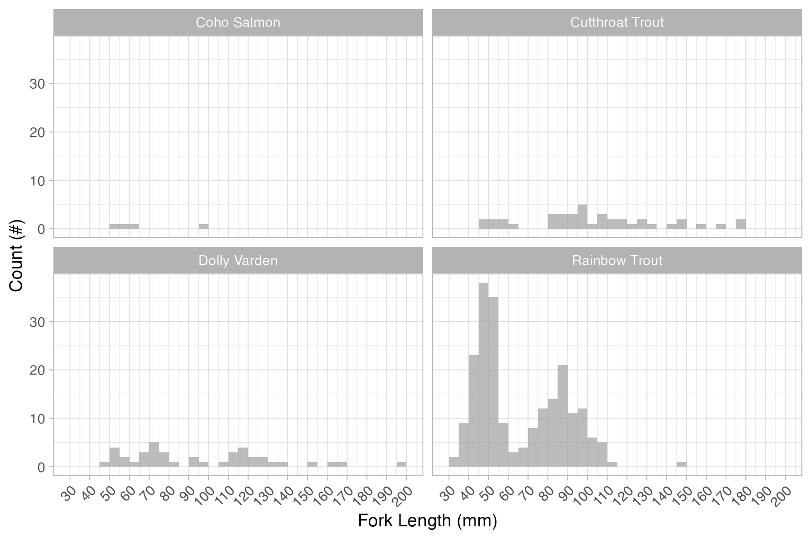

# Results and Discussion

`r if(gitbook_on){knitr::asis_output("Results of Phase 1 and Phase 2 assessments are summarized in Figure \\@ref(fig:map-interactive) with additional details provided in sections below.")}`

<br>

```{r map-interactive, fig.cap='Map of fish passage and habitat confirmation results', eval=F}
# Once run, change back to eval=gitbook_on

##make colors for the priorities
pal <- 
   leaflet::colorFactor(palette = c("red", "yellow", "grey", "black"), 
               levels = c("high", "moderate", "low", "no fix"))

pal_phase1 <- 
   leaflet::colorFactor(palette = c("red", "yellow", "grey", "black"), 
               levels = c("high", "moderate", "low", NA))

# tab_map_phase2 <- tab_map |> filter(source %like% 'phase2')
#https://stackoverflow.com/questions/61026700/bring-a-group-of-markers-to-front-in-leaflet
# marker_options <- markerOptions(  
#   zIndexOffset = 1000)

# tracks <- sf::read_sf("./data/habitat_confirmation_tracks.gpx", layer = "tracks")


# wshd_study_areas <- sf::read_sf('data/fishpass_mapping/fishpass_mapping.gpkg', layer = 'wshd_study_areas')

wshds <- sf::read_sf('data/fishpass_mapping/fishpass_mapping.gpkg', layer = 'hab_wshds')

# photo_metadata <- readr::read_csv(file = 'data/photo_metadata.csv')

  
map <- leaflet::leaflet(height=500, width=780) |>
  leaflet::addTiles()  |> 
  # leafem::addMouseCoordinates(proj4 = 26911) |> ##can't seem to get it to render utms yet
  # leaflet::addProviderTiles(providers$"Esri.DeLorme") |> 
  leaflet::addProviderTiles("Esri.WorldTopoMap", group = "Topo") |>
  leaflet::addProviderTiles("Esri.WorldImagery", group = "ESRI Aerial") |> 
  # leaflet::addPolygons(data = wshd_study_areas, color = "#F29A6E", weight = 1, smoothFactor = 0.5,
  #             opacity = 1.0, fillOpacity = 0,
  #             fillColor = "#F29A6E", label = wshd_study_areas$watershed_group_name) |>
  leaflet::addPolygons(data = wshds, color = "#0859C6", weight = 1, smoothFactor = 0.5,
              opacity = 1.0, fillOpacity = 0.25,
              fillColor = "#00DBFF",
              label = wshds$stream_crossing_id,
              popup = leafpop::popupTable(x = dplyr::select(wshds |> sf::st_set_geometry(NULL),
                                                     Site = stream_crossing_id,
                                                     elev_site:area_km),
                                          feature.id = F,
                                          row.numbers = F),
              group = "Phase 2") |> 
  leaflet::addLegend(
    position = "topright",
    colors = c("red", "yellow", "grey", "black"),
    labels = c("High", "Moderate", "Low", 'No fix'), opacity = 1,
    title = "Fish Passage Priorities") |> 
  
leaflet::addCircleMarkers(data=dplyr::filter(tab_map, stringr::str_detect(source, 'phase1') | stringr::str_detect(source, 'pscis_reassessments')),
                 label = dplyr::filter(tab_map, stringr::str_detect(source, 'phase1') | stringr::str_detect(source, 'pscis_reassessments')) |> dplyr::pull(pscis_crossing_id),
                 # label = tab_map$pscis_crossing_id,
                 labelOptions = leaflet::labelOptions(noHide = F, textOnly = TRUE),
                 popup = leafpop::popupTable(x = dplyr::select((tab_map |> sf::st_set_geometry(NULL) |> dplyr::filter(stringr::str_detect(source, 'phase1') | stringr::str_detect(source, 'pscis_reassessments'))),
                                                        Site = pscis_crossing_id, Priority = priority_phase1, Stream = stream_name, Road = road_name, `Habitat value`= habitat_value, `Barrier Result` = barrier_result, `Culvert data` = data_link, `Culvert photos` = photo_link, `Model data` = model_link),
                                             feature.id = F,
                                             row.numbers = F),
                 radius = 9,
                 fillColor = ~pal_phase1(priority_phase1),
                 color= "#ffffff",
                 stroke = TRUE,
                 fillOpacity = 1.0,
                 weight = 2,
                 opacity = 1.0,
                 group = "Phase 1") |> 
  # leaflet::addPolylines(data=tracks,
  #              opacity=0.75, color = '#e216c4',
  #              fillOpacity = 0.75, weight=5, group = "Phase 2") |>

leaflet::addAwesomeMarkers(
    lng = as.numeric(photo_metadata$gps_longitude),
    lat = as.numeric(photo_metadata$gps_latitude),
    popup = leafpop::popupImage(photo_metadata$url, src = "remote"),
    clusterOptions = leaflet::markerClusterOptions(),
    group = "Phase 2") |>

  #commented out this section for now until tab_hab_map object is built from cost estimate table
  leaflet::addCircleMarkers(
    data=tab_hab_map,
    label = tab_hab_map$pscis_crossing_id,
    labelOptions = leaflet::labelOptions(noHide = T, textOnly = TRUE),
    popup = leafpop::popupTable(x = dplyr::select((tab_hab_map |> sf::st_drop_geometry()),
                                           Site = pscis_crossing_id,
                                           Priority = priority,
                                           Stream = stream_name,
                                           Road = road_name,
                                           `Habitat (m)`= upstream_habitat_length_m,
                                           Comments = comments,
                                           `Culvert data` = data_link,
                                           `Culvert photos` = photo_link,
                                           `Model data` = model_link),
                                feature.id = F,
                                row.numbers = F),
    radius = 9,
    fillColor = ~pal(priority),
    color= "#ffffff",
    stroke = TRUE,
    fillOpacity = 1.0,
    weight = 2,
    opacity = 1.0,
    group = "Phase 2"
    ) |>

  leaflet::addLayersControl(
    baseGroups = c(
      "Esri.DeLorme",
      "ESRI Aerial"),
    overlayGroups = c("Phase 1", "Phase 2"),
    options = leaflet::layersControlOptions(collapsed = F)) |>
  leaflet.extras::addFullscreenControl() |>
  leaflet::addMiniMap(tiles = leaflet::providers$"Esri.NatGeoWorldMap",
             zoomLevelOffset = -6, width = 100, height = 100)

map


```

## Collaborative GIS Environment

In addition to numerous layers documenting fieldwork activities since 2020, a summary of background information spatial layers and tables loaded to the collaborative GIS project (`r params$gis_project_name`) at the
time of writing (`r format(lubridate::now(), "%Y-%m-%d")`) are included 
`r if(identical(gitbook_on, FALSE)){knitr::asis_output("online [here](https://newgraphenvironment.github.io/fish_passage_skeena_2024_reporting/)")}else{knitr::asis_output("in Table \\@ref(tab:tab-rfp-tracking).")}`

```{r rfp-metadata, eval = params$update_gis}
# grab the metadata
md <- rfp::rfp_meta_bcd_xref()

# burn locally so we don't nee to wait for it
md |> 
  readr::write_csv("data/rfp_metadata.csv")
```


```{r rfp-tracking-copy, eval = params$update_gis}

md_raw <- readr::read_csv("data/rfp_metadata.csv")

md <- dplyr::bind_rows(
  md_raw,
  rfp::rfp_xref_layers_custom
) 
                    
# first we will copy the doc from the Q project to this repo - the location of the Q project is outside of the repo!!
q_path_stub <- "~/Projects/gis/sern_skeena_2023/"

# this is differnet than Neexdzii Kwa as it lists layers vs tracking file (tracking file is newer than this project).  
# could revert really easily to the tracking file if we wanted to.
gis_layers_ls <- sf::st_layers(paste0(q_path_stub, "background_layers.gpkg")) 

gis_layers <- tibble::tibble(content = gis_layers_ls[["name"]])
   
# remove the `_vw` from the end of content
rfp_tracking_prep <- dplyr::left_join(
  gis_layers |> 
    dplyr::distinct(content, .keep_all = FALSE),
  
  md |> 
    dplyr::select(content = object_name, url = url_browser, description),
  
  by = "content"
) |> 
  dplyr::arrange(content)

rfp_tracking_prep |> 
  readr::write_csv("data/rfp_tracking_prep.csv")

```

```{r tab-rfp-tracking, eval= gitbook_on}
rfp_tracking_prep <- readr::read_csv(
  "data/rfp_tracking_prep.csv"
) 

rfp_tracking_prep |> 
  fpr::fpr_kable(caption_text = "Layers loaded to collaborative GIS project.",
                 footnote_text = "Metadata information for bcfishpass and bcfishobs layers can be provided here in the future but  currently can usually be sourced from https://smnorris.github.io/bcfishpass/06_data_dictionary.html .",
                 scroll = gitbook_on)


```


## Phase 1 - Fish Passage Assessemnts

Field assessments were conducted between `r format(min(pscis_phase1$date), format="%B %d, %Y")` and `r format(max(pscis_phase1$date), format="%B %d, %Y")` by Allan Irvine, R.P.Bio. and Lucy Schick, B.Sc., Tieasha Pierre, Vern Joseph, Jesse Olson, and Jessica Doyon. A total of `r pscis_all |> filter(source != 'pscis_phase2.xlsm') |> nrow()` Fish Passage Assessments were completed, including `r n_distinct(pscis_phase1$my_crossing_reference)` Phase 1 assessments and `r pscis_reassessments |> nrow()` reassessments. In 2024, field efforts prioritized revisiting previously assessed sites for monitoring rather than evaluating new Fish Passage Assessment locations. As this was the fifth year of the study, a substantial number of sites had already been assessed, allowing the focus to shift toward monitoring and informing restoration activities at key locations.

<br>

Of the `r pscis_all |> filter(source != 'pscis_phase2.xlsm') |> nrow()` sites where fish passage assessments were completed, `r pscis_phase1 |> nrow()` were not yet inventoried in the PSCIS system.  This included `r pscis_phase1 |> filter(barrier_result == 'Passable') |> nrow()` crossings considered "passable", `r pscis_phase1 |> filter(barrier_result == 'Potential') |> nrow() |> english::as.english()` crossings considered a "potential" barrier, and `r pscis_phase1 |> filter(barrier_result == 'Barrier') |> nrow()` crossings considered "barriers" according to threshold values based on culvert embedment, outlet drop, slope, diameter (relative to channel size) and length [@fish_passage_assessments].

<!-- Additionally, although all were considered fully passable, `r pscis_phase1 |> filter(barrier_result == 'Unknown') |> nrow() |> english::as.english()` crossings assessed were fords and ranked as "unknown" according to the provincial protocol.  -->

<br>

Reassessments were completed at `r pscis_reassessments |> nrow()` sites where PSICS data required updating.

<br>

A summary of crossings assessed, a rough cost estimate for remediation and a priority ranking for follow up for Phase 1 sites is presented in Table \@ref(tab:cost-est-phase-1). Detailed data with photos are presented in `r if(gitbook_on){knitr::asis_output("[Appendix - Phase 1 Fish Passage Assessment Data and Photos]")} else knitr::asis_output("[Attachment 2](https://www.newgraphenvironment.com/fish_passage_skeena_2024_reporting/appendix---phase-1-fish-passage-assessment-data-and-photos.html")`.


<br>

The "Barrier" and "Potential Barrier" rankings used in this project followed @fish_passage_assessments and represent an assessment of passability for juvenile salmon or small resident rainbow trout under any flow conditions that may occur throughout the year [@clarkinNationalInventoryAssessment2005; @bellFisheriesHandbookEngineering1991; @thompsonAssessingFishPassage2013]. As noted in @bourne_etal2011Barriersfish, with a detailed review of different criteria in @kemp_ohanley2010Proceduresevaluating, passability of barriers can be quantified in many different ways. Fish physiology (i.e. species, length, swim speeds) can make defining passability complex but with important implications for evaluating connectivity and prioritizing remediation candidates [@bourne_etal2011Barriersfish; @shaw_etal2016Importancepartial; @mahlum_etal2014EvaluatingBarrier; @kemp_ohanley2010Proceduresevaluating].  @washingtondepartmentoffishwildlife2009FishPassage present criteria for assigning passability scores to culverts that have already been assessed as barriers in coarser level assessments. These passability scores provide additional information to feed into decision making processes related to the prioritization of remediation site candidates and have potential for application in British Columbia.  


`r if(gitbook_on){knitr::asis_output("")} else knitr::asis_output("<br><br><br><br>")`

<br>


```{r cost-est-phase-1, eval = T}

 tab_cost_est_phase1 |>
  select(`PSCIS ID`:`Cost Est ( $K)`) |> 
   fpr::fpr_kable(caption_text = 'Upstream habitat estimates and cost benefit analysis for Phase 1 assessments. Steelhead network model (total length stream network <20% gradient).',
                  scroll = gitbook_on)
```

<br>

## Phase 2 - Habitat Confirmation Assessments

During the 2024 field assessments, habitat confirmation assessments were conducted at three sites within the Morice River, Kispiox River, and Bulkley River watershed groups. A total of approximately `r habitat_confirmations_priorities |> pull(length_surveyed) |> sum(na.rm = TRUE) |> round(-3)/1000` km of stream was assessed. Electrofishing surveys were conducted at all habitat confirmation sites. Georeferenced field maps are provided in Attachment 1.

<br>

As collaborative decision making was ongoing at the time of reporting, site prioritization can be considered preliminary. 
Results are summarized in `r if(gitbook_on){knitr::asis_output("Figure \\@ref(fig:map-interactive) and ")}` Tables \@ref(tab:tab-overview) - \@ref(fig:plot-fish-all) with raw habitat and fish sampling data included in digital format [here](`r paste0(params$repo_url, "blob/main/data/habitat_confirmations.xls")`). A summary of preliminary modeling results illustrates the estimated Chinook, coho, and steelhead spawning and rearing habitat potentially available upstream of each crossing, based on measured/modelled channel width and upstream accessible stream length, as presented in Figure \@ref(fig:plot-model-all). Detailed information for each site assessed with Phase 2 assessments (including maps) are presented within site specific appendices to this document.

`r if(gitbook_on){knitr::asis_output("")} else knitr::asis_output("<br><br><br><br>")`

<br>


```{r tab-overview, eval = TRUE}
table_phase2_overview <- function(dat, caption_text = '', font = font_set, scroll = TRUE){
  dat2 <- dat |>
    kable(caption = caption_text, booktabs = T, label = NA) |>
    kableExtra::kable_styling(c("condensed"),
                              full_width = T,
                              font_size = font) |>
    kableExtra::column_spec(column = c(11), width_min = '3in') |>
    kableExtra::column_spec(column = c(1:10), width_max = '1.2in')

  if(identical(scroll,TRUE)){
    dat2 <- dat2 |>
      kableExtra::scroll_box(width = "100%", height = "500px")
  }
  dat2
}

tab_overview |> 
  table_phase2_overview(caption_text = 'Overview of habitat confirmation sites. Steelhead rearing model used for habitat estimates (total length of stream segments <8.5% gradient)', 
                        scroll = gitbook_on)

```

`r if(gitbook_on){knitr::asis_output("<br>")} else knitr::asis_output("\\pagebreak")`


```{r phase-2-cv-assess-sum}
fpr::fpr_table_cv_summary(dat = pscis_phase2)  |>  
  fpr::fpr_kable(caption_text = 'Summary of Phase 2 fish passage reassessments.', scroll = F)
```


`r if(gitbook_on){knitr::asis_output("<br>")} else knitr::asis_output("\\pagebreak")`


```{r cost-est-phase-2, eval=F}
tab_cost_est_phase2_report |>
  fpr::fpr_kable(caption_text = 'Cost benefit analysis for Phase 2 assessments. Steelhead rearing model used (total length of stream segments <7.5% gradient)',
                 scroll = gitbook_on)

```


`r if(gitbook_on){knitr::asis_output("<br>")} else knitr::asis_output("\\pagebreak")`

```{r tab-habitat-summary}
tab_hab_summary |> 
  dplyr::filter(stringr::str_like(Location, 'upstream')) |> 
  dplyr::select(-Location) |> 
  dplyr::rename(`PSCIS ID` = Site, `Length surveyed upstream (m)` = `Length Surveyed (m)`) |>
  fpr::fpr_kable(caption_text = 'Summary of Phase 2 habitat confirmation details.', scroll = F)


```

<br>

```{r tab-wshd-sum-all}
fpr::fpr_table_wshd_sum() |> 
  fpr::fpr_kable(caption_text = paste0('Summary of watershed area statistics upstream of Phase 2 crossings.'),
                                 footnote_text = 'Elev P60 = Elevation at which 60% of the watershed area is above', scroll = F)

```

<br>

```{r plot-model-all, fig.cap='Summary of potential habitat upstream of habitat confirmation assessment sites estimated based on modelled channel width and upstream channel length.', eval=T}


bcfp_xref_plot <- xref_bcfishpass_names |> 
  filter(!is.na(id_join) &
         !stringr::str_detect(bcfishpass, 'below') &
         !stringr::str_detect(bcfishpass, 'all') &
         !stringr::str_detect(bcfishpass, '_ha') &
         (stringr::str_detect(bcfishpass, 'rearing') | 
          stringr::str_detect(bcfishpass, 'spawning')))


bcfishpass_phase2_plot_prep <- bcfishpass |> 
  dplyr::mutate(dplyr::across(where(is.numeric), round, 1)) |>
  dplyr::filter(stream_crossing_id %in% (pscis_phase2 |> dplyr::pull(pscis_crossing_id))) |> 
  dplyr::select(stream_crossing_id, dplyr::all_of(bcfp_xref_plot$bcfishpass)) |> 
  dplyr::mutate(stream_crossing_id = as.factor(stream_crossing_id)) |> 
  tidyr::pivot_longer(cols = ch_spawning_km:st_rearing_km) |> 
  dplyr::filter(value > 0.0 &
                !is.na(value)) |> 
  dplyr::mutate(
    name = stringr::str_replace_all(name, '_rearing', ' rearing'),
    name = stringr::str_replace_all(name, '_spawning', ' spawning')
  )
  
  
  
bcfishpass_phase2_plot_prep |> 
  ggplot2::ggplot(ggplot2::aes(x = stream_crossing_id, y = value)) +
  ggplot2::geom_bar(stat = "identity") +
  ggplot2::facet_wrap(~name, ncol = 2) +
  ggdark::dark_theme_bw(base_size = 11) +
  ggplot2::theme(axis.text.x = ggplot2::element_text(angle = 90, hjust = 1, vjust = 0.5)) +
  ggplot2::labs(x = "Site", y = "Modelled habitat (km)")


```


### Fish Sampling


Fish sampling was conducted at `r tab_fish_sites_sum |> n_distinct()` sites within `r tab_fish_sites_sum |> distinct(stream) |> nrow()` streams, with a total of `r tab_fish_summary |> dplyr::pull(count_fish) |> sum(na.rm = TRUE)` fish captured. Fork length, weight, and species were documented for each fish.

DRAFT NEEDS WORK TO BE MORE CLEAR 
All sampled sites were habitat confirmation sites; however, Sandstone Creek was assessed in 2023, while the other sites were assessed in 2024. Electrofishing was conducted at Sandstone Creek during both years, with additional electrofishing in 2024 to build on previous data. At this site only, salmonids with fork lengths >60mm were PIT-tagged to facilitate long-term tracking of health and movement.

Fork length data was used to delineate salmonids based on life stages: fry (0 to 65mm), parr (>65 to 110mm), juvenile (>110mm to 140mm) and adult (>140mm) by visually assessing the histograms presented in Figure \@ref(fig:fish-histogram).  A summary of sites assessed are included in Table \@ref(tab:tab-fish-site-summary) and raw data is provided in [Attachment 3](https://github.com/NewGraphEnvironment/fish_passage_skeena_2023_reporting/blob/main/data/habitat_confirmations.xls). A summary of density results for all life stages combined of select species is also presented in Figure \@ref(fig:plot-fish-all). 

DRAFT NEEDS WORK TO BE MORE CLEAR 
Results are presented in greater detail within individual habitat confirmation site appendices, and for sandstone Creek [here](https://www.newgraphenvironment.com/fish_passage_skeena_2022_reporting/). 

<br>

```{r fish-histogram, fig.cap= 'Histograms of fish lengths by species.  Fish captured by electrofishing during habitat confirmation assessments.', eval = F}


```


`r if(gitbook_on){knitr::asis_output("")} else knitr::asis_output("<br><br><br><br>")`

<br>

```{r tab-fish-site-summary}
tab_fish_sites_sum |> 
  fpr::fpr_kable(caption_text = 'Summary of electrofishing sites.')
```

<br>

```{r plot-fish-all, fig.cap='Boxplots of densities (fish/100m2) of fish captured by electrofishing during habitat confirmation assessments.', eval=T}

plot_fish_box_all <- fish_abund |> 
  dplyr::filter(
    !species_code %in% c('MW', 'SU', 'NFC', 'CT', 'LSU')
  ) |> 
  ggplot2::ggplot(ggplot2::aes(x = location, y = density_100m2)) +
  ggplot2::geom_boxplot() +
  ggplot2::facet_grid(site ~ species_code, scales = "fixed", as.table = TRUE) +
  ggplot2::theme(legend.position = "none", axis.title.x = ggplot2::element_blank()) +
  ggplot2::geom_dotplot(binaxis = 'y', stackdir = 'center', dotsize = 1) +
  ggplot2::ylab(expression(Density ~ (Fish/100 ~  m^2))) +
  ggplot2::theme_light()
  # ggdark::dark_theme_bw()


plot_fish_box_all
```

## Phase 3 - Design
At the time of reporting, designs for remediation of fish passage had been completed for the following sites listed by watershed group:


### Bulkley River

- McDowell Creek - PSCIS 58159 - Private Road.  Design for clear-span bridge completed in 2021 Onsite Engineering with
funding provided through this program. Background presented  [here](https://www.newgraphenvironment.com/fish_passage_bulkley_2020_reporting/).
- Tyhee Creek - PSCIS 123445 - Highway 16. Preliminary design commissioned from Pacific North Coast Consulting by Canadian Wildlife Federation.  Background presented  [here](https://www.newgraphenvironment.com/fish_passage_bulkley_2020_reporting/).
- Helps Creek - PSCIS 124500 - Lawson Road. Background presented  [here](https://www.newgraphenvironment.com/fish_passage_bulkley_2020_reporting/).
- Thompson Creek - 123377 - Walcott Road.  At the time of reporting, geotechnical assessments were underway from consultants
under contract to the Ministry of Transportation and Infrastructure
to inform the design of the replacement structure. Background presented [here](https://www.newgraphenvironment.com/fish_passage_skeena_2021_reporting/). 
- Tributary to Buck Creek - PSCIS 197640 - Buck Flats Road. Preliminary design commisioned from Pacific North Coast Consulting by Canadian Wildlife Federation. Background presented  [here](https://www.newgraphenvironment.com/fish_passage_bulkley_2020_reporting/).
- Station  Creek (also know as Mission Creek) - PSCIS 124420. Preliminary design commisioned from Pacific North Coast Consulting by Canadian Wildlife Federation. Background presented [here](https://www.newgraphenvironment.com/fish_passage_skeena_2021_reporting/).


### Morice River

- Riddeck Creek - PSCIS 197360 - Morice-Owen FSR. Design developed by consultants under contract to the Ministry of 
Water, Lands and Resource Stewardship. Some materials have been purchased for construction and the site has been incorporated
into the Bii Wenii Kwa Restoration/Recovery Plan lead by the Office of the Wet’suwet’en. Background presented [here](https://www.newgraphenvironment.com/fish_passage_bulkley_2020_reporting/).
- Alvin Creek - PSCIS 197379 - Morice-Owen FSR (km 29.8).  Design developed by Mark Dewitt from the Ministry of Forests. Background presented [here](https://www.newgraphenvironment.com/fish_passage_bulkley_2020_reporting/). the site has been incorporated
into the Bii Wenii Kwa Restoration/Recovery Plan lead by the Office of the Wet’suwet’en.


## Phase 4 - Remediations

Remediation of fish passage has been completed at the following sites (listed by watershed group):

### Bulkley River 
- McDowell Creek - 58159 - Private Road.  Replaced with a clear-span bridge in 2022 with remediation work led by the Canadian Wildlife Federation. Background presented  [here](https://www.newgraphenvironment.com/fish_passage_bulkley_2020_reporting/).
- Robert Hatch Creek - 197912 - Unnamed Road. Removal of the collapsed bridge in 2022 with remediation work led by the Canadian Wildlife Federation. Background presented  [here](https://www.newgraphenvironment.com/fish_passage_skeena_2021_reporting/).


### Kispiox River
- Tributary to Skeena River - 198217 - Sik-E-Dakh Water Tower Road.  Replacement of the crossing with a clear-span bridge in 2024
with remediation work led by the Gitskan Watershed Authorities. This project serves as a great example to follow in future installations, demonstrating thoughtful erosion control and re-vegetation, a wide, stable channel with minimal riprap, and strategic riprap placement that was effectively buried to maintain natural channel morphology. Background information - updated in 2025 - can be found [here](https://www.newgraphenvironment.com/fish_passage_skeena_2022_reporting/)


## Monitoring

Two sites were revisited in 2024 to gather data to further inform prioritization and/or to provide data for effectiveness monitoring. Below are the sites visited with details of data collected and links to reporting provided.

### Buck Creek

Buck Creek features a significant series of waterfalls, collectively referred to as Buck falls, located approximately 30 km upstream of its confluence with the Bulkley River. Situated downstream of the Buck Creek and Buck Flats Road crossing, the falls consist of a series of vertical and cascading drops. During the 2024 assessment, a site visit was conducted to document Buck Falls, including UTM coordinates, height, and gradient, to assess the feasibility of fish passage. Buck falls has been previously documented by @gottesfeld_rabnett2007SkeenaFish, the World Waterfall Database [@BuckFallsBritishColumbiaCanadaWorldWaterfallDatabase], and in Houston Hikers as a popular hiking trail [@BuckFallsAdventures]. Given previous uncertainty regarding fish access, the assessment aimed to determine whether further efforts to improve upstream crossings would be justified.

<br>

The upper falls consisted of a ~4 m high vertical drop, presenting a substantial barrier to fish passage (Figure \@ref(fig:photo-buck-01)). Approximately 25 m downstream, the second falls was a ~3.5 m high sheer drop to bedrock, with minimal pool depth available to facilitate fish passage (Figure \@ref(fig:photo-buck-02)). Further downstream ~100 m, the third step comprised a ~1.5 m vertical drop with an overlying cascade, exhibiting a ~15% gradient over a 1.0 m height (Figure \@ref(fig:photo-buck-03)). An additional cascade, located a further ~25 m downstream, featured a ~2 m high drop with a ~30% gradient extending over a 5 m length (Figure \@ref(fig:photo-buck-04)).

<br>

Historically, salmonids have been documented above Buck Falls in the FISS database; however, fish passage beyond these barriers is considered highly improbable [@moe2024KnownBC].

<br>

Water quality measurements recorded at the site indicated a conductivity of 269 µS/cm, a temperature of 6.7°C, and a pH of 8.2.

<br>

Pink salmon have been noted as spawning in the first reach of Buck Creek, with coho spawners noted to Reach 3, and chinook spawners to Reach 5 where the subject tributary enters the mainstem (NCFDC 1998).

```{r photo-buck-01-prep, eval=T}
my_site = "buck_falls"

my_photo1 = fpr::fpr_photo_pull_by_str(str_to_pull = '_falls1')

my_caption1 = paste0("Buck Falls – The upper falls featured a ~4 m high vertical drop. A 2 m tall net is included for scale.")


```

```{r photo-buck-01, fig.cap= my_caption1, out.width = photo_width, eval=gitbook_on}
knitr::include_graphics(my_photo1)
```

<br>

```{r photo-buck-02-prep, eval=T}
my_photo2 = fpr::fpr_photo_pull_by_str(str_to_pull = '_falls2')

my_caption2 = paste0("Buck Falls – The second falls consisted of a ~3.5 m high sheer drop to bedrock.")


```

```{r photo-buck-02, fig.cap= my_caption2, out.width = photo_width, eval=gitbook_on}
knitr::include_graphics(my_photo2)
```

```{r photo-buck-d01, fig.cap = my_caption, fig.show="hold", out.width= c("49.5%","1%","49.5%"), eval=identical(gitbook_on, FALSE)}
my_caption <- paste0('Left: ', my_caption1, ' Right: ', my_caption2)

knitr::include_graphics(my_photo1)
knitr::include_graphics("fig/pixel.png")
knitr::include_graphics(my_photo2)
```

<br>

```{r photo-buck-03-prep, eval=T}

my_photo1 = fpr::fpr_photo_pull_by_str(str_to_pull = '_falls3')

my_caption1 = paste0("Buck Falls – The third step consisted of a ~1.5 m vertical drop with an overlying cascade, exhibiting a ~15% gradient over a 1.0 m height.")


```

```{r photo-buck-03, fig.cap= my_caption1, out.width = photo_width, eval=gitbook_on}
knitr::include_graphics(my_photo1)
```

<br>

```{r photo-buck-04-prep, eval=T}
my_photo2 = fpr::fpr_photo_pull_by_str(str_to_pull = '_falls4')

my_caption2 = paste0("Buck Falls – An additional cascade featured a ~2 m high drop with a ~30% gradient extending over a 5 m length. A 2 m tall net is included for scale.")

```

```{r photo-buck-04, fig.cap= my_caption2, out.width = photo_width, eval=gitbook_on}
knitr::include_graphics(my_photo2)
```

```{r photo-buck-d02, fig.cap = my_caption, fig.show="hold", out.width= c("49.5%","1%","49.5%"), eval=identical(gitbook_on, FALSE)}
my_caption <- paste0('Left: ', my_caption1, ' Right: ', my_caption2)

knitr::include_graphics(my_photo1)
knitr::include_graphics("fig/pixel.png")
knitr::include_graphics(my_photo2)
```

<br>

<!-- ### Morice River -->

<!-- All sites below have been incorporated -->
<!-- into the Bii Wenii Kwa Restoration/Recovery Plan lead by the Office of the Wet’suwet’en. -->

<!-- - Riddeck Creek - PSCIS 197360 - Morice-Owen FSR. Electrofishing was conducted above and below the crossing and fish over 60mm were tagged with PIT tags so that their movement and health can be tracked over time.  Results are presented [here](https://www.newgraphenvironment.com/fish_passage_bulkley_2020_reporting/).  -->

<!-- - Alvin Creek - PSCIS 197379 - Morice-Owen FSR (km 29.8). Revisited with the intention to conduct fish sampling however the stream was primarily dry with water present only within a small culvert outlet pool. Areas electrofished in 2022 were surveyed with PIT tag reader to scope for tags from potential mortalities related  -->
<!-- to the dewatering.  Results are presented [here](https://www.newgraphenvironment.com/fish_passage_bulkley_2020_reporting/).  -->

<!-- - Tributary to Owen Creek - PSCIS 197378 - Klate lake Road. Electrofishing was conducted above and below the crossing and fish over 60mm were tagged with PIT tags so that their movement and health can be tracked over time. Aerial imagery was also collected utilizing an unmanned aerial vehicle. Results are presented [here](https://www.newgraphenvironment.com/fish_passage_skeena_2021_reporting/) -->


<!-- ### Kispiox River -->

<!-- - Tributary to Skeena River - PSCIS 198217 - Sik-E-Dakh Water Tower Road.  Prior to replacement of the crosssing in the spring of 2024, electrofishing was conducted above and below the crossing and fish over 60mm were tagged with PIT tags so that their movement and health can be tracked over time. Additionally, lidar imagery was also collected utilizing an unmanned aerial vehicle.  Aerial imagery and lidar data were collected with a drone. Results are presented [here](https://www.newgraphenvironment.com/fish_passage_skeena_2022_reporting/). -->

<!-- - Dale Creek - PSCIS 198215 - Kispiox Westside Road. Electrofishing was conducted above and below the crossing and fish over 60mm were tagged with PIT tags so that their movement and health can be tracked as part of effectiveness monitoring at the site. Results are presented [here](https://www.newgraphenvironment.com/fish_passage_skeena_2022_reporting/). -->

<!-- - Sterritt creek - 198225 - Babine Slide FSR.  Revisited with the intention to conduct fish sampling however, before sampling was conducted surveyors observed a 2 - 3m high near vertical cascade flowing over bedrock into the small culvert outlet pool immediately below the FSR. It was decided to not proceed with electrofishing as replacement of the culvert with a bridge would not facilitate upstream fish migration. Results are presented [here](https://www.newgraphenvironment.com/fish_passage_skeena_2022_reporting/). -->


## Five Year Summary

Summary of fish passage assessment procedures conducted in the Skeena through SERNbc since 2020.

```{r ld-db}
conn = fpr::fpr_db_conn()

sites_all <- fpr::fpr_db_query(
  query = "SELECT * FROM working.fp_sites_tracking"
)

DBI::dbDisconnect(conn)
```

```{r summarize-sites}

# unique(sites_all$watershed_group_name)
# 
# # here is a list of SERN wtershed groups
wsg_skeena <- c("Bulkley River",
              "Zymoetz River",
              "Kispiox River",
              "Kalum River",
              "Morice River"
              )

wsg_code_skeena <- c(
  'BULK','KISP','KLUM','MORR','ZYMO',
  'BABL', 'BABR', 'LKEL', 'LSKE', 'MSKE', 'SUST'
)

# wsg_peace <- c(
#               "Parsnip River",
#               "Carp Lake",
#               "Crooked River"
#               )

# more straight forward is new graph only watersheds
# wsg_ng <- "Elk River"

# here is a summary with Elk watershed group removed
sites_all_summary <- sites_all |> 
  # make a flag column for uav flights
  dplyr::mutate(
    uav = dplyr::case_when(
      !is.na(link_uav1) ~ "yes",
      T ~ NA_character_
    )) |> 
  # remove the elk counts
  dplyr::filter(watershed_group %in% wsg_skeena) |>
  dplyr::group_by(watershed_group) |> 
  dplyr::summarise(
    dplyr::across(assessment:fish_sampling, ~ sum(!is.na(.x))),
    uav = sum(!is.na(uav))
  ) |> 
  sf::st_drop_geometry() |> 
  # make pretty names
  dplyr::rename_with(~ stringr::str_replace_all(., "_", " ") |> 
                       stringr::str_to_title()) |> 
  # annoying special case
  dplyr::rename(
    `Drone Imagery` = Uav) |> 
  janitor::adorn_totals()
```

```{r tab-sites-sum-cap, results="asis"}
my_caption = "Summary of fish passage assessment procedures conducted in the Skeena through SERNbc since 2020."
my_tab_caption()
```

```{r tab-sites-sum}
sites_all_summary |> 
  my_dt_table(
    page_length = 20,
    cols_freeze_left = 0
              )
```

<br>


```{r tab-sites-cap, results="asis"}
my_caption = "Details of fish passage assessment procedures conducted in the Skeena through SERNbc since 2020."
my_tab_caption()
```

```{r tab-sites-all}
sites_all |>
  sf::st_drop_geometry() |>
  dplyr::relocate(watershed_group, .after = my_crossing_reference) |> 
  dplyr::select(-idx) |>
  # make pretty names
  dplyr::rename_with(~ . |>
                       stringr::str_replace_all("_", " ") |>
                       stringr::str_replace_all("repo", "Report") |>
                       stringr::str_replace_all("uav", "Drone") |>
                       stringr::str_to_title()) |> 
  # dplyr::arrange(desc(stream_crossing_id)) |> 
  
  my_dt_table(
    cols_freeze_left = 1,
    escape = FALSE
  )
```

