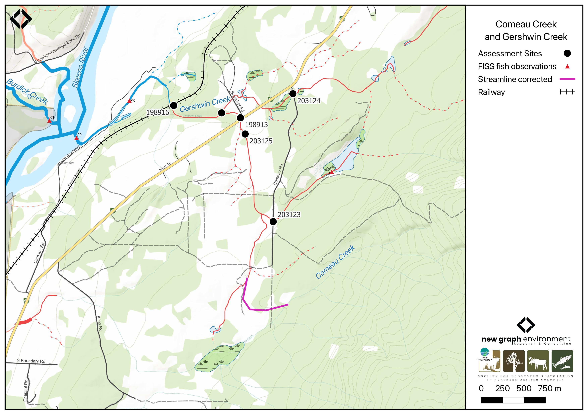

```{r setup-198913, eval = F}
knitr::opts_chunk$set(echo=FALSE, message=FALSE, warning=FALSE)
source('scripts/packages.R')
source('scripts/02_reporting/tables.R')
```

```{r  load-data-198913}
my_site <- 198916
my_site2 <- 198913

```

# Comeau Creek - 198916 & 198913 - Appendix {-}

## Site Location {.unnumbered}

BC Freshwater atlas mapping of this watershed is incorrect as the main stream at the confluence with the Skeena River is actually 
Comeau Creek vs Gershwin Creek - as it is labelled in provincial mapping (Figure \@ref(fig:map-198916)).  Gershwin Creek is a much smaller
tributary that flows into Comeau Creek approximately 270m downstream of Highway 16 at a location 
2.5km upstream from the Comeau Creek/Skeena River confluence. As noted in @mccarthy2000ComeauCreek  - the mainstem of Comeau Creek deviates from the mapped Comeau Creek stream line approximately 5.3km upstream of the incorrectly mapped confluence of Comeau Creek and 
the Skeena River and enters the drainage labelled as Gershwin Creek at a location 4.8km upstream of the true Comeau Creek 
confluence with the Skeena River (see corrected streamline in Figure \@ref(fig:map-198916)). 

<br>

PSCIS crossing `r as.character(my_site)` is located on `r fpr::fpr_my_pscis_info()` on the CN Railway `r round(fpr::fpr_my_bcfishpass(col_pull = downstream_route_measure)*0.001, 1)`km upstream of the confluence of `r fpr::fpr_my_pscis_info()` and the Skeena River. PSCIS crossing `r as.character(my_site2)` is located on Comeau Creek at Highway 16.  Comeau Creek flows into Gershwin Creek just downstream of the highway.  Both sites are within the Kispiox River watershed group.  PSCIS crossing `r as.character(my_site)` is owned by CN Rail and `r as.character(my_site2)` is the responsibility of the Ministry of Transportation and Infrastructure.

<br>

```{r map-198916, fig.cap = my_caption}
my_caption <- "Comeau Creek and Gershwin Creek"



```

<br>

## Background {.unnumbered}

```{r}
# # A`r fpr::fpr_my_pscis_info()` is mapped as a
# `r fpr::fpr_my_bcfishpass() |> english::ordinal()` order stream with an
# upstream watershed area of approximately
# `r fpr::fpr_my_wshd()`km^2^. The watershed ranges in elevation from
# a maximum of `r fpr::fpr_my_wshd(col = 'elev_max')`m to
# `r fpr::fpr_my_wshd(col = 'elev_site')`m near the lower crossing (Table
# \@ref(tab:tab-wshd-198916)). 
```


In 1999, @mccarthy2000ComeauCreek conducted a detailed survey of Comeau Creek including the area from the confluence with 
the Skeena River to a point estimated as the upstream limit to fish (7.2km distance).  During that survey two pairs of 
coho salmon were observed spawning at location approximately 100m and 130m upstream of the Skeena River confluence. 
A 2m high beaver dam located ~50m further upstream was noted as likely limiting migration of both spawning adults and rearing 
juveniles at that time.  @mccarthy2000ComeauCreek document the culverts located on the CN Railway and Highway 16 (among others)
and note that the CN Railway crossing is likely impassible for fish migrating upstream due to its length (98m)
shallow water depths (7cm) and high velocity discharge (2 m/s). Also noted within this study was extensive minnowtrapping
upstream of Highway 16 with Dolly Varden and cutthrout trout captured.

<br>

@mccarthy_fernando20152015Inventory ranked crossing `r as.character(my_site)` on the CN Railway as a high priority for restoration 
and recommend improving upstream fish migration conditions through the installation of baffles and backwatering structures.  

<br>

In 2023, fish passage assessments were completed on Comeau Creek at PSCIS crossings `r as.character(my_site)` and `r as.character(my_site2)`, located on the CN railway and Highway 16, respectively, as well as for Gershwin Creek at PSCIS crossing 198907 on Braucher Road. Assessment data and photos are presented in @irvine_schick2023SkeenaWatershed [here](https://www.newgraphenvironment.com/fish_passage_skeena_2023_reporting/appendix---phase-1-fish-passage-assessment-data-and-photos.html). These assessments documented high-value habitat upstream of the railway crossing and fish observed in the outlet pool downstream of the Highway 16 crossing.

<br>

Within provincial databases, coho salmon and pink salmon spawning is noted 90m and 750m upstream of the confluence of 
Comeau Creek and the Skeena River.  Additionally, `r fpr::fpr_my_fish_sp()` are documented in the lake upstream of the Highway 16 crossing (`r as.character(my_site2)`) [@norris2024smnorrisbcfishobs; @moe2024KnownBC]. 

<br>

In 2024, habitat confirmation assessments and fish sampling were conducted upstream and downstream of Comeau Creek PSCIS crossings `r as.character(my_site)` and `r as.character(my_site2)`, located on the CN railway and Highway 16, respectively. That same year, two additional crossings on Comeau Road were assessed with fish passage assessments, with results presented in `r if(gitbook_on){knitr::asis_output("[Appendix - Phase 1 Fish Passage Assessment Data and Photos]")}else(knitr::asis_output("[Attachment - Phase 1 Data and Photos](#attach-pdf-phase1-dat)"))`. The first—PSCIS crossing 203124 on Gershwin Creek—was located approximately 100m up Comeau Road from Highway 16. The second—PSCIS crossing 203123 on a tributary to Comeau Creek—was located approximately 1.6km up Comeau Road from the highway. Field observations and review of BC Freshwater Atlas mapping between these two crossings suggest that the lake/wetland area mapped as upstream of crossing 203123, where Dolly Varden and cutthroat trout observations have been recorded, likely drains northwest to Gershwin Creek rather than southeast to Comeau Creek as currently indicated in provincial mapping.


```{r tab-wshd-198916, eval = F}
fpr::fpr_table_wshd_sum(site_id = my_site) |> 
  fpr::fpr_kable(caption_text = paste0('Summary of derived upstream watershed statistics for PSCIS crossing ', my_site, '.'),
           footnote_text = 'Elev P60 = Elevation at which 60% of the watershed area is above',
           scroll = F)

```

<!-- Habitat modelling outputs from bcfishpass indicated 4.4km of coho rearing habitat upstream of the railway crossing (`r as.character(my_site)`) and 1.7 km upstream of the Highway 16 crossing (`r as.character(my_site2)`) (gradients <5.5% for coho). However, the estimate for the railway crossing includes the tributary, which is unlikely to provide much habitat beyond the wetlands located 350 m upstream, just past PSCIS crossing 198907. Additionally, based on the assessment of the PSCIS crossing 203123 approximately 1.3km upstream of the Highway 16 crossing (`r as.character(my_site2)`), where the stream had no visible channel, a more conservative estimate of coho rearing habitat upstream of the Highway 16 crossing likely 1.3km, while upstream of the railway crossing, it is approximately 2.3km. -->

<br>

A map of the watershed is provided in
map attachment
[`r fpr::fpr_my_bcfishpass(col_pull = dbm_mof_50k_grid)`](`r fpr::fpr_my_mapsheet(wshd = "kisp", archive_date = "2022-09-06")`).

```{r tab-culvert-bcfp-198916, eval = F}
# likley bogus
# Although modelling outputs from bcfishpass are presented in Table
# \@ref(tab:tab-culvert-bcfp-198916)). 
fpr::fpr_table_bcfp(scroll = gitbook_on) 
```

<br>


## Stream Characteristics at Crossings `r as.character(my_site)` and `r as.character(my_site2)`  {.unnumbered}

At the time of assessment, PSCIS crossing `r as.character(my_site)` on the CN Railway was
un-embedded, non-backwatered and ranked as a
`r fpr::fpr_my_pscis_info(col_pull = barrier_result) |> stringr::str_to_lower()` to upstream fish passage according to the provincial protocol
[@moe2011Fieldassessment] (Table \@ref(tab:tab-culvert-198916)). Constructed in the 1920s, this crossing is a concrete box culvert approximately 100 m in length, located beneath the CN railway with approximately 30–40 m of fill above it. It features a 0.45m outlet drop that adult fish could likely overcome but is presumed to act as a barrier to juvenile fish due to high velocities caused by the culvert's steep slope (6%) and shallow flow depths. 

<br>

PSCIS crossing  `r as.character(my_site2)` on Highway 16 was un-embedded, non-backwatered and ranked as a `r fpr::fpr_my_pscis_info(site = my_site2, col_pull = barrier_result) |> stringr::str_to_lower()` to upstream fish passage according to the provincial protocol
[@moe2011Fieldassessment] (Table \@ref(tab:tab-culvert-198913)). The crossing had a 0.35m outlet drop and a 0.85m deep outlet pool, suggesting the culvert is undersized for the stream.

<br>

Water temperature was `r fpr::fpr_my_habitat_info(loc = "ds", col_pull = 'temperature_c')`$^\circ$C,
pH was `r fpr::fpr_my_habitat_info(loc = "ds", col_pull = 'p_h')` and
conductivity was `r fpr::fpr_my_habitat_info(loc = "ds", col_pull = 'conductivity_m_s_cm')` uS/cm.

<br>

Data and photos for Comeau Road crossings assessed with fish passage assessments are presented in `r if(gitbook_on){knitr::asis_output("[Appendix - Phase 1 Fish Passage Assessment Data and Photos]")}else(knitr::asis_output("[Attachment - Phase 1 Data and Photos](#attach-pdf-phase1-dat)"))`.  For PSCIS crossing 203124 on Gershwin Creek located approximately 100m up the road from the highway - debris was partially clogging the pipe inlet had caused water to pool upstream of the road with a very small defined channel downstream (<1m). The second crossing - PSCIS  203123 - on a tributary to Comeau Creek - was located approximately 1.6km up the road from the highway. At this location the stream had no visible channel.  

`r if(identical(gitbook_on, FALSE)){knitr::asis_output("\\pagebreak")}`

<br>

```{r tab-culvert-198916, eval = T}
# fpr::fpr_table_cv_summary_memo()

# See issue https://github.com/NewGraphEnvironment/mybookdown-template/issues/65
lfpr_table_cv_summary_memo()

```

<br>

```{r tab-culvert-198913, eval = T}
# fpr::fpr_table_cv_summary_memo(site = my_site2, site_photo_id = my_site2)

# See issue https://github.com/NewGraphEnvironment/mybookdown-template/issues/65
lfpr_table_cv_summary_memo(site = my_site2, site_photo_id = my_site2)

```

<br>

```{r eval=F}
##this is useful to get some comments for the report
hab_site |> filter(site == my_site & location == 'ds') |> pull(comments)
hab_site |> filter(site == my_site & location == 'us') |> pull(comments)
hab_site |> filter(site == my_site2 & location == 'us') |> pull(comments)

```


## Stream Characteristics Downstream of Crossing `r as.character(my_site)` {.unnumbered}

`r fpr_my_survey_dist(loc = 'ds')`. The stream contained numerous boulders forming step pools; however, moderate flows at the time of assessment limited the availability of pools suitable for fish. The first pool suitable for overwintering fish, with adequately reduced flow, was located approximately 250m downstream of the culvert. There were occasional gravels suitable for spawning and frequent large woody debris, which contributed to the formation of additional steps. `r if(gitbook_on){knitr::asis_output("(Figure \\@ref(fig:photo-198916-01)).")}else(knitr::asis_output("(Figure \\@ref(fig:photo-198916-d01))."))` `r fpr_my_habitat_paragraph(loc = 'ds')` The habitat was rated as `r fpr::fpr_my_priority_info(loc = 'ds') |> stringr::str_to_lower()` value suitable for salmonid rearing and spawning. 

<br>

## Stream Characteristics Upstream of Crossing `r as.character(my_site)` and Downstream of Crossing `r as.character(my_site2)` {.unnumbered}

The stream was surveyed from the railway crossing (`r as.character(my_site)`) upstream to the Highway 16 crossing (`r as.character(my_site2)`), a distance of approximately 900 m `r if(gitbook_on){knitr::asis_output("(Figures \\@ref(fig:photo-198916-02) - \\@ref(fig:photo-198913-01)).")}else(knitr::asis_output("(Figures \\@ref(fig:photo-198916-d01)- \\@ref(fig:photo-198913-d01))."))` A large woody debris jam was observed approximately 250m upstream of the railway crossing, creating a 17% gradient over a 9m section due to a fallen tree. The stream maintained good flow through this steeper section, supported by a healthy, mature mixed riparian forest that stabilized the banks. `r fpr_my_habitat_paragraph(loc = 'us')` The habitat was rated as `r fpr::fpr_my_priority_info(loc = 'us') |> stringr::str_to_lower()` value and contained occasional pockets of gravels suitable for spawning by coho salmon, Dolly Varden, and cutthroat trout.

<br>


## Stream Characteristics Upstream of Crossing `r as.character(my_site2)` {.unnumbered}

The stream was surveyed upstream from crossing 198913 - located on Highway 16 for 600m. The stream had frequent pools suitable for overwintering fish, with spawning gravels present despite a significant amount of fines. In the ~200 m section just upstream of the crossing, the stream maintained a low gradient and flowed through agricultural fields with mature cottonwood riparian cover throughout the entire area surveyed `r if(gitbook_on){knitr::asis_output("(Figure \\@ref(fig:photo-198913-02)).")}else(knitr::asis_output("(Figure \\@ref(fig:photo-198913-d01))."))``r fpr_my_habitat_paragraph(sit = my_site2, loc = 'us')` The habitat was rated as `r fpr::fpr_my_priority_info(sit = my_site2, loc = 'us') |> stringr::str_to_lower()` value for salmonid rearing an spawning. 

<br>

## Fish Sampling {.unnumbered}

Electrofishing was conducted on Comeau Creek below and above the railway crossing (PSCIS `r as.character(my_site)`) as well as 
upstream and downstream of the crossing on Highway 16 (PSCIS `r as.character(my_site2)`). Comeau Creek railway crossing (PSCIS `r as.character(my_site)`) results are summarised in Tables \@ref(tab:tab-fish-site-198916) - \@ref(tab:tab-fish-dens-198916) and Figure \@ref(fig:plot-fish-box-198916). A total of `r tab_fish_summary |> filter(site_id == paste0(my_site, '_ds')) |> group_by(site_id) |> janitor::adorn_totals() |> filter(site_id == 'Total') |> pull(count_fish)` fish were captured downstream including Dolly Varden and cutthroat trout, and `r tab_fish_summary |> filter(site_id == paste0(my_site, '_us')) |> group_by(site_id) |> janitor::adorn_totals() |> filter(site_id == 'Total') |> pull(count_fish)` Dolly Varden were captured upstream `r if(gitbook_on){knitr::asis_output("(Figure \\@ref(fig:photo-198916-03)).")}else(knitr::asis_output("(Figures \\@ref(fig:photo-198913-d02))."))`

<br>

Electrofishing results for upstream and downstream of the crossing on Highway 16 (PSCIS `r as.character(my_site2)`) are summarised in Tables \@ref(tab:tab-fish-site-198913) - \@ref(tab:tab-fish-dens-198913) and Figure
\@ref(fig:plot-fish-box-198913). A total of `r tab_fish_summary |> filter(site_id == paste0(my_site2, '_ds')) |> group_by(site_id) |> janitor::adorn_totals() |> filter(site_id == 'Total') |> pull(count_fish)` fish were captured downstream including Dolly Varden and cutthroat trout, and `r tab_fish_summary |> filter(site_id == paste0(my_site2, '_us')) |> group_by(site_id) |> janitor::adorn_totals() |> filter(site_id == 'Total') |> pull(count_fish)` Dolly Varden were captured upstream `r if(gitbook_on){knitr::asis_output("(Figure \\@ref(fig:photo-198913-03)).")}else(knitr::asis_output("(Figures \\@ref(fig:photo-198913-d02))."))`

<br>


## Structure Remediation and Cost Estimate {.unnumbered}

Should restoration/maintenance activities proceed, replacement of the railway crossing (`r as.character(my_site)`) with a bridge or open bottom structure is  estimated to cost \$ `r format(fpr::fpr_my_cost_estimate(), big.mark = ',')`. As noted in @mccarthy_fernando20152015Inventory - installing baffles within the culvert would likely improve fish passage conditions as a less expensive interim solution.  

<br>

Until the downstream railway crossing is upgraded, replacement of the upstream crossing on Highway 16 (`r as.character(my_site2)`) is not recommended. If the downstream crossing is upgraded, the Highway 16 crossing could be replaced with a bridge spanning `r fpr::fpr_my_pscis_info(site = my_site2, col_pull = recommended_diameter_or_span_meters)`m. At the time of reporting in 2025, the estimated cost for the replacement was \$ `r format(fpr::fpr_my_cost_estimate(site = my_site2), big.mark = ',')`.


## Conclusion {.unnumbered}

PSCIS crossings `r as.character(my_site)` and `r as.character(my_site2)` are located on Comeau Creek which provides 
medium to high-value habitat suitable for coho salmon, Dolly Varden, and cutthroat trout. Conservative 
estimates indicate approximately 2.3km of mainstem habitat upstream of the railway crossing likely suitable for coho rearing. 

<br>

PSCIS crossing `r as.character(my_site)` on the CN Railway is an exceptionally long concrete box culvert under 
30–40m of fill. It is likely a barrier to upstream migration to all species and life stages due to its extensive length, 0.45m outlet 
drop, steep slope, shallow flows and high flow velocities within the structure. The site was rated as a `r fpr::fpr_my_priority_info(col_pull = priority) |> stringr::str_to_lower()` priority for replacement - however, given the significant cost and scale of such a project, baffle
installation and backwatering could be explored as an alternate interim solution to improve fish passage conditions. Replacement 
of PSCIS crossing `r as.character(my_site2)` on Highway 16 could be explored if upgrades to the downstream railway crossing are planned.

<br>


Although the size of the stream and gradients observed within the areas of Comeau Creek surveyed in 2024 indicate the 
stream is suitable for coho, none were captured downstream of the railway via electrofishing indicating that 
the species was not utilizing the areas fished at the time of sampling. These observations align with reporting from
 @mccarthy2000ComeauCreek - which noted beaver activity likely blocking upstream coho migration near the confluence with 
 the Skeena River. @mccarthy2000ComeauCreek recommend efforts be undertaken to trasfer coho salmon juveniles to upstream of the 
 beaver dam with the intent of increasing coho productivity in the stream.  Provided beaver dams are present and 
 coho spawners still utilize this system, implementing this recommendation could be considered.
 A full assessment of the area between the railway crossing and the confluence of the Skeena River is recommended during 
 the fall to scope for coho and pink spawners and update the state of knowledge regarding natural and man-made barriers
 in this section of stream.


`r if(gitbook_on){knitr::asis_output("<br>")} else knitr::asis_output("\\pagebreak")`


```{r tab-habitat-summary-198916, eval = T}
tab_hab_summary |>
  dplyr::filter(Site %in% c(my_site, my_site2)) |> 
  fpr::fpr_kable(caption_text = paste0("Summary of habitat details for PSCIS crossings ", my_site, " and ", my_site2, "."),
                 scroll = F) 

```


<br>

```{r tab-fish-site-198916, eval=T}
fpr::fpr_table_fish_site()

```

<br>

```{r tab-fish-site-198913, eval=T}
fpr::fpr_table_fish_site(sit = my_site2)

```

<br>

```{r tab-fish-dens-198916, eval=T}
fpr::fpr_table_fish_density()

```

<br>

```{r tab-fish-dens-198913, eval=T}
fpr::fpr_table_fish_density(sit = my_site2)

```

`r if(gitbook_on){knitr::asis_output("<br>")} else knitr::asis_output("\\pagebreak")`

```{r plot-fish-box-198916, fig.cap= my_caption, eval=T}
my_caption <- paste0('Densites of fish (fish/100m2) captured upstream and downstream of PSCIS crossing ', my_site, '.')

fpr::fpr_plot_fish_box() 

```

<br>

```{r plot-fish-box-198913, fig.cap= my_caption, eval=T}
my_caption <- paste0('Densites of fish (fish/100m2) captured upstream and downstream of PSCIS crossing ', my_site2, '.')

fpr::fpr_plot_fish_box(sit = my_site2) 

```

<br>

```{r photo-198916-01-prep, eval=T}
my_photo1 = fpr::fpr_photo_pull_by_str(str_to_pull = 'ds_typical_1_')

my_caption1 = paste0('Typical habitat downstream of PSCIS crossing ', my_site, '.')


```

```{r photo-198916-01, fig.cap= my_caption1, out.width = photo_width, eval=gitbook_on}
knitr::include_graphics(my_photo1)
```

<br>

```{r photo-198916-02-prep, eval=T}
my_photo2 = fpr::fpr_photo_pull_by_str(str_to_pull = 'us_typical_1')

my_caption2 = paste0('Typical habitat upstream of PSCIS crossing ', my_site, '.')


```

```{r photo-198916-02, fig.cap= my_caption2, out.width = photo_width, eval=gitbook_on}
knitr::include_graphics(my_photo2)
```

```{r photo-198916-d01, fig.cap = my_caption, fig.show="hold", out.width= c("49.5%","1%","49.5%"), eval=identical(gitbook_on, FALSE)}
my_caption <- paste0('Left: ', my_caption1, ' Right: ', my_caption2)

knitr::include_graphics(my_photo1)
knitr::include_graphics("fig/pixel.png")
knitr::include_graphics(my_photo2)
```

<br>

```{r photo-198913-01-prep, eval=T}
my_photo1 = fpr::fpr_photo_pull_by_str(site = my_site, str_to_pull = 'us_pool')

my_caption1 = paste0('Typical habitat downstream of PSCIS crossing ', my_site2, '.')
```

```{r photo-198913-01, fig.cap= my_caption1, out.width = photo_width, eval=gitbook_on}
knitr::include_graphics(my_photo1)
```

<br>

```{r photo-198913-02-prep, eval=T}
my_photo2 = fpr::fpr_photo_pull_by_str(site = my_site2, str_to_pull = 'us_typical_2')

my_caption2 = paste0('Typical habitat upstream of PSCIS crossing ', my_site2, '.')
```

```{r photo-198913-02, fig.cap= my_caption1, out.width = photo_width, eval=gitbook_on}
knitr::include_graphics(my_photo2)
```

```{r photo-198913-d01, fig.cap = my_caption, fig.show="hold", out.width= c("49.5%","1%","49.5%"), eval=identical(gitbook_on, FALSE)}

my_caption <- paste0('Left: ', my_caption1, ' Right: ', my_caption2)

knitr::include_graphics(my_photo1)
knitr::include_graphics("fig/pixel.png")
knitr::include_graphics(my_photo2)
```

<br>

```{r photo-198916-03-prep, eval=T}
my_photo1 = fpr::fpr_photo_pull_by_str(str_to_pull = 'fish_1')

my_caption1 = paste0('Cutthroat trout captured downstream of crossing ', my_site, '.')


```

```{r photo-198916-03, fig.cap= my_caption1, out.width = photo_width, eval=gitbook_on}
knitr::include_graphics(my_photo1)
```

<br>

```{r photo-198913-03-prep, eval=gitbook_on}
my_photo2 = fpr::fpr_photo_pull_by_str(site = my_site2, str_to_pull = 'fish_1')

my_caption2 = paste0('Dolly varden with captured downstream of crossing ', my_site2, '.')

```

```{r photo-198913-03, fig.cap=my_caption2, out.width=photo_width, eval = T}
knitr::include_graphics(my_photo2)


```

```{r photo-198913-d02, fig.cap = my_caption, fig.show="hold", out.width= c("49.5%","1%","49.5%"), eval=identical(gitbook_on, FALSE)}

my_caption <- paste0('Left: ', my_caption1, ' Right: ', my_caption2)

knitr::include_graphics(my_photo1)
knitr::include_graphics("fig/pixel.png")
knitr::include_graphics(my_photo2)
```


